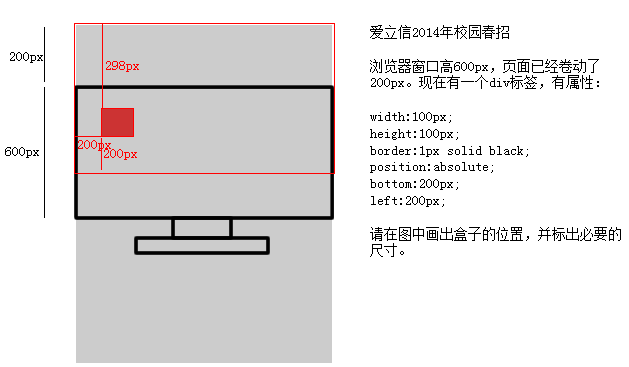
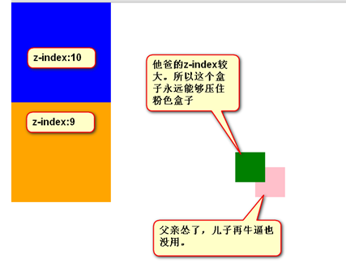

今天接着来学习CSS，go！本节内容有相对定位、绝对定位、固定定位和z-index。


相对定位：

复制

```
position:relative;
```

绝对定位：

复制

```
position:absolute;
```

固定定位：

复制

```
position:fixed;
```

## 相对定位

- 认识相对定位

相对定位，就是微调元素位置的。让元素**相对自己原来的位置，进行位置调整**。

- 不脱标，老家留坑，形影分离

相对定位不脱标，真实位置是在老家，只不过影子出去了，可以到处飘

- 相对定位用途

相对定位有坑，所以一般不用于做“压盖”效果。页面中，效果极小。就两个作用：

1） **微调**元素

2） 做绝对定位的参考，子绝父相。

- 相对定位的定位植

可以用left、right来描述盒子右、左的移动；

可以用top、bottom来描述盒子的下、上的移动。

↘：

复制

```
position:relative;top:10px;left:40px;
```

↙：

复制

```
position:relative;right:100px; → 往左边移动top: 100px;
```

↖：

复制

```
position: relative;	right: 100px;bottom: 100px;    → 移动方向是向上。
```

↗：

复制

```
position: relative;top: -200px;       → 负数就是相反的方向，如果是正，就是下边，如果是负数就是上边right: -200px;
```

↗：

复制

```
position: relative;right: -300px;bottom: 300px;
```

完全等价于：

复制

```
position: relative;left: 300px;bottom: 300px;
```

## 绝对定位

绝对定位比相对定位更灵活。

- 绝对定位脱标

对定位的盒子，是脱离标准文档流的。所以，所有的标准文档流的性质，绝对定位之后都不遵守了。

绝对定位之后，标签就不区分所谓的行内元素、块级元素了，不需要display:block;就可以设置宽、高了：

复制

```
span{position: absolute;top: 100px;left: 100px;width: 100px;height: 100px;background-color: pink;}
```

- 参考点

绝对定位的参考点，如果用top描述，那么定位参考点就是页面的左上角，而不是浏览器的左上角：


如果用bottom描述，那么就是浏览器首屏窗口尺寸，对应的页面的左下角：


面试题：



- 以盒子为参考点

一个绝对定位的元素，如果父辈元素中出现了也定位了的元素，那么将以父辈这个元素，为参考点。


要听最近的已经定位的祖先元素的，不一定是父亲，可能是爷爷：

复制

```
<div class="box1">   →  相对定位	<div class="box2">  →  没有定位		<p></p>   → 绝对定位，将以box1为参考，因为box2没有定位，box1就是最近的父辈元素	</div></div>
```

复制

```
<div class="box1">   →  相对定位	<div class="box2">  →  相对定位		<p></p>   → 绝对定位，将以box2为参考，因为box2是自己最近的父辈元素	</div></div>
```

不一定是相对定位，任何定位，都可以作为参考点

复制

```
<div>	→ 绝对定位	<p></p>	→ 绝对定位，将以div作为参考点。因为父亲定位了。</div>
```

子绝父绝、子绝父相、子绝父固，都是可以给儿子定位的。但是，工程上子绝、父绝，没有一个盒子在标准流里面了，所以页面就不稳固，没有任何实战用途。工程上，“子绝父相”有意义，父亲没有脱标，儿子脱标在父亲的范围里面移动。

绝对定位的儿子，无视参考的那个盒子的padding。

下图中，绿色部分是div的padding，蓝色部分是div的内容区域。那么此时，div相对定位，p绝对定位。

p将无视父亲的padding，在border内侧为参考点，进行定位：


绝对定位的盒子居中

绝对定位之后，所有标准流的规则，都不适用了。所以margin:0 auto;失效。

复制

```
width: 600px;height: 60px;position: absolute;left: 50%;top: 0;margin-left: -300px;   → 宽度的一半
```

非常简单，当做公式记忆下来。就是left:50%;
margin-left:负的宽度的一半。

## 固定定位

固定定位，就是相对浏览器窗口定位。页面如何滚动，这个盒子显示的位置不变。

固定定位脱标！

## z-index

● z-index值表示谁压着谁。数值大的压盖住数值小的。

● 只有定位了的元素，才能有z-index值。也就是说，不管相对定位、绝对定位、固定定位，都可以使用z-index值。而浮动的东西不能用。

● z-index值没有单位，就是一个正整数。默认的z-index值是0。

● 如果大家都没有z-index值，或者z-index值一样，那么谁写在HTML后面，谁在上面能压住别人。定位了的元素，永远能够压住没有定位的元素。

● 从父现象：父亲怂了，儿子再牛逼也没用。

**没有单位：**

复制

```
z-index:888
```

