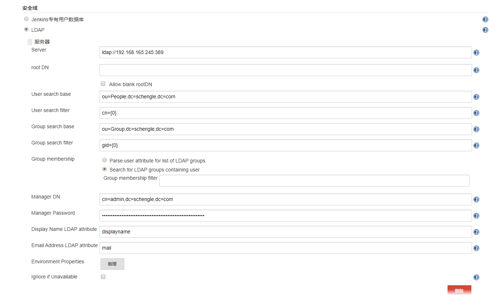

## ansible安装jenkins

```shell
ansible-galaxy install clay_wangzhi.jenkins
```

galaxy中有详细的文档说明：

> 链接地址：https://galaxy.ansible.com/clay_wangzhi/jenkins

额外注意一些插件的安装：

```
Role-based Authorization Strategy  #权限控制插件
git-parameter
Publish Over SSH
DIngDIng
git-parameter #选项参数增加，git-brach选项
```

## 配置管理工具

安装完成后，配置管理工具

### 按装并配置git

```shell
yum -y install git
```


编辑git环境变量为/usr/bin/git

### 安装并配置maven

```shell
wget https://mirrors.tuna.tsinghua.edu.cn/apache/maven/maven-3/3.6.3/binaries/apache-maven-3.6.3-bin.tar.gz
tar -xvf apache-maven-3.6.3-bin.tar.gz
mv apache-maven-3.6.3 /usr/local/maven
```

`vim /etc/profile.d/maven.sh`

```shell
#!/bin/bash
export M2_HOME=/usr/local/maven
export PATH=$PATH:$M2_HOME/bin
```

```
source /etc/profile.d/maven.sh
mvn --version
```

编辑maven的环境变量为/usr/local/maven

### 安装并配置ansible

```shell
yum -y install ansible
```

编辑ansible的环境变量为/usr/bin

## jenkins集成openldap

参考图片



> 集成ldap参考链接：https://www.cnblogs.com/mascot1/p/10498513.html

