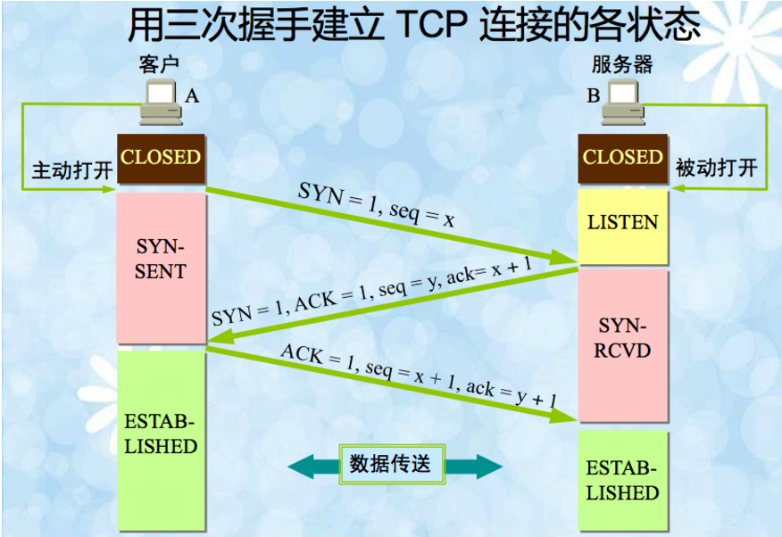

TCP协议即TCP（传输控制协议）。 

Transmission Control Protocol 传输控制协议TCP是一种面向连接（连接导向）的、可靠的、基于字节流的传输层（Transport layer）通信协议，由IETF的RFC 793说明（specified）。TCP在IP报文的协议号是6。在简化的计算机网络OSI模型中，它完成第四层传输层所指定的功能，UDP是同一层内另一个重要的传输协议。

## TCP首部

`TCP`数据也是封装在`IP`数据报中，`TCP`首部格式如下图所示：

标记位：

* SYN：同步标记位
* ACK：确认标记位
* RST：重置标记位
* PSH：推标记位
* URG：紧急标记位
* FIN：结束标记位

## 三次握手

1. 第一次握手：客户端发送**syn包**(syn=j)到服务器，并进入**SYN_SEND**状态，等待服务器确认;
2. 第二次握手：服务器收到syn包，必须**确认客户的SYN**(ack=j+1)，**同时自己也发送一个SYN包(syn=k)，即SYN+ACK包**，此时服务器进入**SYN_RECV**状态;
3. 第三次握手：客户端收到服务器的SYN+ACK包，向服务器发送**确认包ACK**(ack=k+1)，此包发送完毕，客户端和服务器进入**ESTABLISHED**状态，完成三次握手。

## 四次挥手

**注意：中断连接端可以是Client端，也可以是Server端，那么就是图上的流程反过来操作**

解释（以客户端发起断开为例子）

- 假设Client端发起中断连接请求，也就是发送FIN报文。Server端接到FIN报文后，意思是说”**我Client端没有数据要发给你了**“
- 但是如果你还有数据没有发送完成，则不必急着关闭Socket，可以继续发送数据。所以你先发送ACK，”**告诉Client端，你的请求我收到了，但是我还没准备好，请继续你等我的消息**“。– 这个时候Client端就进入FIN_WAIT状态，继续等待Server端的FIN报文。当Server端确定数据已发送完成，则向Client端发送FIN报文，”**告诉Client端，好了，我这边数据发完了，准备好关闭连接了**“。
- Client端收到FIN报文后，”就知道可以关闭连接了，但是他还是不相信网络**，怕Server端不知道要关闭，所以发送ACK后进入TIME_WAIT状态，如果Server端没有收到ACK则可以重传**。“
- Server端收到ACK后，”**就知道可以断开连接了**“。Client端等待了2MSL后依然没有收到回复，则证明Server端已正常关闭，**那好，我Client端也可以关闭连接了**。Ok，TCP连接就这样关闭了！

## 问题

为什么连接的时候是三次握手，关闭的时候却是四次握手？

答：因为当Server端收到Client端的SYN连接请求报文后，**可以直接发送SYN+ACK报文**。其中ACK报文是用来应答的，SYN报文是用来同步的。但是关闭连接时，当Server端收到FIN报文时，很可能并不会立即关闭SOCKET，所以只能先回复一个ACK报文，告诉Client端，”你发的FIN报文我收到了”。只有等到我Server端所有的报文都发送完了，我才能发送FIN报文，**因此不能一起发送**。故需要四步握手。

为什么TIME_WAIT状态需要经过2MSL(最大报文段生存时间)才能返回到CLOSE状态？

答：虽然按道理，四个报文都发送完毕，我们可以直接进入CLOSE状态了，但是我们必须假象网络是不可靠的，**有可以最后一个ACK丢失。所以TIME_WAIT状态就是用来重发可能丢失的ACK报文。**

那四次挥手又是为何呢？TCP协议是一种面向连接的、可靠的、基于字节流的运输层通信协议。**TCP是全双工模式**，这就意味着，当主机1发出FIN报文段时，**只是表示主机1已经没有数据要发送了**，主机1告诉主机2，它的数据已经全部发送完毕了；但是，**这个时候主机1还是可以接受来自主机2的数据**；当主机2返回ACK报文段时，表示它已经知道主机1没有数据发送了，**但是主机2还是可以发送数据到主机1的**；当主机2也发送了FIN报文段时，这个时候就表示主机2也没有数据要发送了，就会告诉主机1，我也没有数据要发送了，之后彼此就会愉快的中断这次TCP连接。

