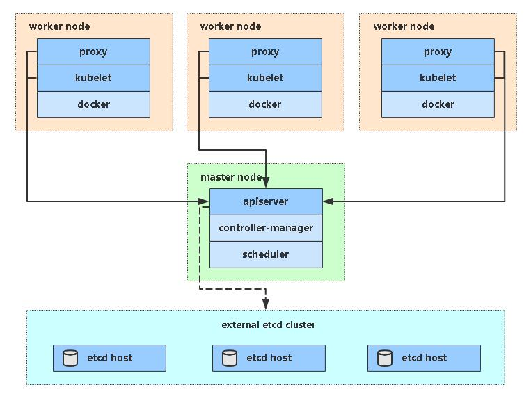

kubeadm是官方社区推出的一个用于快速部署kubernetes集群的工具。

这个工具能通过两条指令完成一个kubernetes集群的部署：

```
# 创建一个 Master 节点
$ kubeadm init

# 将一个 Node 节点加入到当前集群中
$ kubeadm join <Master节点的IP和端口 >
```

## 1 安装要求

在开始之前，部署Kubernetes集群机器需要满足以下几个条件：

- 一台或多台机器，操作系统 CentOS7.x-86_x64
- 硬件配置：2GB或更多RAM，2个CPU或更多CPU，硬盘30GB或更多
- 集群中所有机器之间网络互通
- 可以访问外网，需要拉取镜像
- 禁止swap分区

## 2 准备环境



| 角色       | IP              |
| ---------- | --------------- |
| k8s-master | 192.168.166.84  |
| k8s-node1  | 192.168.166.227 |
| k8s-node2  | 192.168.31.63   |

```
关闭防火墙：
$ systemctl stop firewalld
$ systemctl disable firewalld

关闭selinux：
$ sed -i 's/enforcing/disabled/' /etc/selinux/config  # 永久
$ setenforce 0  # 临时

关闭swap：
$ swapoff -a  # 临时
$ vim /etc/fstab  # 永久

设置主机名：
$ hostnamectl set-hostname <hostname>

在master添加hosts：
$ cat >> /etc/hosts << EOF
192.168.31.61 k8s-master
192.168.31.62 k8s-node1
192.168.31.63 k8s-node2
EOF

加载br_netfilter
$ modprobe br_netfilter

将桥接的IPv4流量传递到iptables的链：
$ cat > /etc/sysctl.d/k8s.conf << EOF
net.bridge.bridge-nf-call-ip6tables = 1
net.bridge.bridge-nf-call-iptables = 1
EOF
$ sysctl -p /etc/sysctl.d/k8s.conf  # 生效

时间同步：
$ yum install ntpdate -y
$ ntp.aliyun.com
```

## 3 所有节点安装Docker/kubeadm/kubelet/kubectl

### 3.1 安装Docker

Kubernetes默认CRI（容器运行时）为Docker，因此先安装Docker。

```
$ yum install -y yum-utils   device-mapper-persistent-data   lvm2
$ wget https://mirrors.aliyun.com/docker-ce/linux/centos/docker-ce.repo -O /etc/yum.repos.d/docker-ce.repo
$ yum -y install docker-ce
$ systemctl enable docker && systemctl start docker
$ docker --version
Docker version 19.03.8, build afacb8b
```

> 由于更新频繁，安装时可以指定docker版本`yum -y install docker-ce-18.06.1.ce-3.el7`

### 3.2 配置docker加速器

```
$ tee /etc/docker/daemon.json <<-'EOF'
{
  "registry-mirrors": ["https://pclhthp0.mirror.aliyuncs.com"]
}
EOF
```

```
systemctl restart docker
```

### 3.3 添加阿里云YUM软件源

```
$ cat <<EOF > /etc/yum.repos.d/kubernetes.repo
[kubernetes]
name=Kubernetes
baseurl=http://mirrors.aliyun.com/kubernetes/yum/repos/kubernetes-el7-x86_64
enabled=1
gpgcheck=0
repo_gpgcheck=0
gpgkey=http://mirrors.aliyun.com/kubernetes/yum/doc/yum-key.gpg
       http://mirrors.aliyun.com/kubernetes/yum/doc/rpm-package-key.gpg
EOF
```

### 3.4 安装kubeadm，kubelet和kubectl

```
$ yum install -y kubelet kubeadm kubectl
$ systemctl enable kubelet && systemctl start kubelet
```

> 由于版本更新频繁，这里指定版本号部署：`yum install -y kubelet-1.17.0 kubeadm-1.17.0 kubectl-1.17.0`

### 3.5 配置kubectl、kubeadm命令的参数补全设置

```
$ cat <<EOF >> /root/.bashrc
source <(kubectl completion bash)
source <(kubeadm completion bash)
EOF
$ source /root/.bashrc
```

## 4 部署Kubernetes Master

可以指定kubernetes的版本

```
$ kubeadm init \
	--apiserver-advertise-address=192.168.166.84 \
	--image-repository registry.aliyuncs.com/google_containers \
	--service-cidr=10.96.0.0/12 \
	--pod-network-cidr=10.244.0.0/16
```

由于默认拉取镜像地址k8s.gcr.io国内无法访问，这里指定阿里云镜像仓库地址。

> 通过`--kubernetes-version v1.17.0`参数，可以指定kubernetes的版本

执行成功后，按提示将相关配置文件复制到用户的home目录下

```
$ mkdir -p $HOME/.kube
$ cp -i /etc/kubernetes/admin.conf $HOME/.kube/config
$ chown $(id -u):$(id -g) $HOME/.kube/config
$ kubectl get nodes
```

> 要记住最后kubeadm join那句话，node节点加入集群时需要。

## 5 安装Pod网络插件（CNI）

```
kubectl apply -f https://raw.githubusercontent.com/coreos/flannel/master/Documentation/kube-flannel.yml
```

由于服务器连接不到raw.githubusercontent.com这个网址，所有我先在本地下载好，然后再传到服务器上去

```
kubectl apply -f  kube-flannel.yml 
```

## 6 加入Kubernetes Node

向集群添加新节点，执行在kubeadm init输出的kubeadm join命令：

```
kubeadm join 192.168.166.84:6443 --token n1cflb.lpl0hrv0uw4zs9fw \
    --discovery-token-ca-cert-hash sha256:82b56d129176bf2d25016c13a9ffd0e6f8298d87d08d8e4e4eb3fd0e72c69ee7 
```

> 这句话为master初始化成功后的最后一句话

## 7 测试kubernetes集群

在master节点执行

```
kubectl get pods --all-namespaces
kubectl get nodes # 初始化时间可能比较长
```

在Kubernetes集群中创建一个pod，验证是否正常运行：

```
kubectl create deployment nginx --image=nginx
kubectl expose deployment nginx --port=80 --type=NodePort
kubectl get pod,svc
```

访问地址：http://NodeIP:Port  

## 8 部署 Dashboard

```
kubectl apply -f https://raw.githubusercontent.com/kubernetes/dashboard/v2.0.0-beta8/aio/deploy/recommended.yaml
```

> 由于服务器连接不到raw.githubusercontent.com这个网址，所有我先在本地下载好，然后再传到服务器上去

默认Dashboard只能集群内部访问，修改Service为NodePort类型，暴露到外部：

```
kind: Service
apiVersion: v1
metadata:
  labels:
    k8s-app: kubernetes-dashboard
  name: kubernetes-dashboard
  namespace: kubernetes-dashboard
spec:
  ports:
    - port: 443
      targetPort: 8443
  selector:
    k8s-app: kubernetes-dashboard
```

将上面改为：

```
kind: Service
apiVersion: v1
metadata:
  labels:
    k8s-app: kubernetes-dashboard
  name: kubernetes-dashboard
  namespace: kubernetes-dashboard
spec:
  type: NodePort
  ports:
    - port: 443
      targetPort: 8443
      nodePort: 32443
  selector:
    k8s-app: kubernetes-dashboard
```

访问地址：http://NodeIP:32443

创建service account并绑定默认cluster-admin管理员集群角色：

```
kubectl create serviceaccount dashboard-admin -n kube-system
kubectl create clusterrolebinding dashboard-admin --clusterrole=cluster-admin --serviceaccount=kube-system:dashboard-admin
kubectl describe secrets -n kube-system $(kubectl -n kube-system get secret | awk '/dashboard-admin/{print $1}')
```

使用输出的token登录Dashboard。