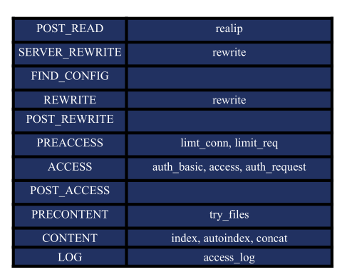
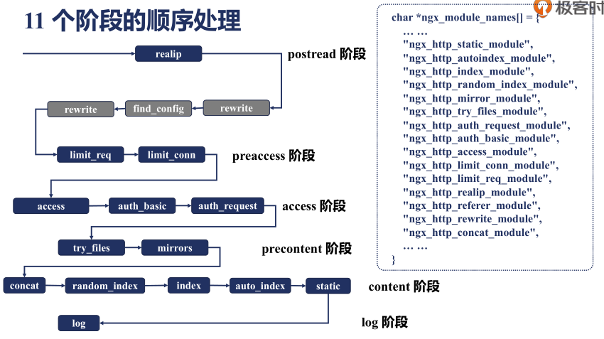
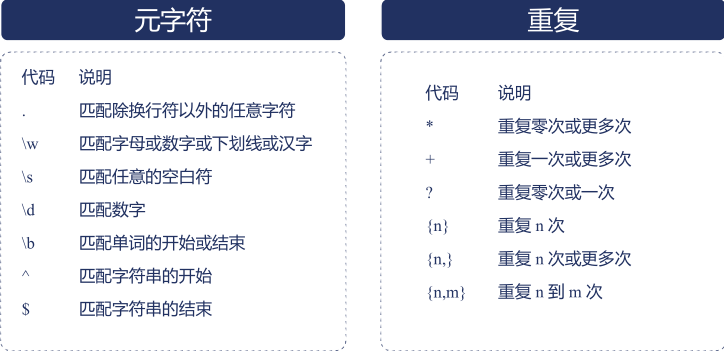

## 1 配置块的嵌套

```nginx
http {
    upstream {...}
    split_clients {...}
    map {...}
    geo {...}
    server {
        if () {...}
        location {
            limit_except {...}
        }
        location {
            location {
                
            }
        }
    }
    server {
    }
}
```

## 2 指令的合并

* 值指令：存储配置项的值
  * 可以合并
  * 示例：root，access_log，gzip
* 动作类指令：指定行为
  * 不可以合并
  * 示例：rewrite，proxy_pass
  * 生效阶段：server_rewrite阶段，rewrite阶段，content阶段

**存储值的指令继承规则：向上覆盖**

* 子配置不存在时，直接使用父配置块
* 子配置存在时，直接覆盖父配置块

```nginx
server {
    listen 8080;
    root /home/geek/nginx/html;
    access_log logs/geek.access.log main;
    location /test {
        root /home/geek/nginx/test;
        access_log logs/access.test.log main;
    }
    location /dlib {
        alias dlib/;
    }
    location / {
    }
}
```

## 3 HTTP请求处理时的11个阶段





## 4 正则表达式




## 5 提取用户真实ip

如何拿到真实的用户ip地址？


拿到真实用户ip后如何使用？

基于变量：如binary_remote_addr、remote_addr这样的变量，其值就为真实的IP！这样做连接限制（limit_conn模块）才有意义！

**步骤**

1. 安装realip模块

   realip是Nginx内置模块，需要在编译Nginx时加上`--with-http_realip_module`参数来启用它。

2. 配置语法

   ```
   set_real_ip_from 192.168.1.0/24; #真实服务器上一级代理的IP地址或者IP段,可以写多行。
   set_real_ip_from 192.168.2.1;
   real_ip_header X-Forwarded-For;  #从哪个header头检索出要的IP地址。
   real_ip_recursive on; #递归的去除所配置中的可信IP。
   ```

   这里详细讲下`real_ip_recursive`的用途：递归的去除所配置中的可信IP，排除set_real_ip_from里面出现的IP。如果出现了未出现这些IP段的IP，那么这个IP将被认为是用户的IP。

3. 配置实例

   ```nginx
   location / {
       root html/;
       proxy_set_header X-Forwarded-For $proxy_add_x_forwarded_for;
       set_real_ip_from 192.168.1.0/24;
       set_real_ip_from 192.168.2.1;
       real_ip_header X-Forwarded-For;
       real_ip_recursive on;
   }
   ```

>参考链接：
>
>https://www.hi-linux.com/posts/53006.html
>
>https://blog.csdn.net/lijunwyf/article/details/79611003