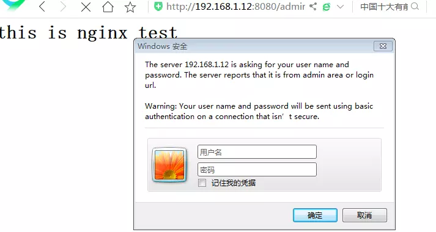

## 七、配置指令和相关配置

#### 调试、定位问题：

- （1）、daemon on|off;
  是否以守护进程方式运行Nignx；
- （2）、master_process on|off;
  是否以master/worker模型运行nginx；默认为on；
- （3）、error_log file [level];错误日志等级

#### 4、事件驱动相关的配置:

```undefined
                events {
                    ...
                }
```

- （1）、worker_connections number;
  每个worker进程所能够打开的最大并发连接数数量；
  worker_processes * worker_connections
- （2）、use method;
  指明并发连接请求的处理方法；
  use epoll;
- （3）、accept_mutex on | off;
  处理新的连接请求的方法；on意味着由各worker轮流处理新请求，Off意味着每个新请求的到达都会通知所有的worker进程；

-----------------------------------------与套接字相关的配置：---------------------------------

#### 1、server { ... }

配置一个虚拟主机；

```bash
server {
listen address[:PORT]|PORT;监听地址端口
server_name SERVER_NAME;服务名
root /PATH/TO/DOCUMENT_ROOT;网页根目录地址
proxy_pass http://ip;#反向代理到指定ip的http服务器，此服务器变成代理服务器，上面的root网页根目录就没用了
}
```

#### 2、监听listen PORT|address[:port]|unix:/PATH/TO/SOCKET_FILE

格式：listen address[:port] [default_server] [ssl] [http2 | spdy] [backlog=number] [rcvbuf=size] [sndbuf=size]

> default_server：设定为默认虚拟主机；
> ssl：限制仅能够通过ssl连接提供服务；
> backlog=number：后援队列长度；
> rcvbuf=size：接收缓冲区大小；
> sndbuf=size：发送缓冲区大小；

#### 3、server_name name ...;主机名

- 指明虚拟主机的主机名称；后可跟多个由空白字符分隔的字符串；
- 支持*通配任意长度的任意字符；server_name *.magedu.com www.magedu.*#左侧和右侧匹配
- 支持~起始的字符做正则表达式模式匹配；server_name ~^www\d+[.magedu.com$#](http://.magedu.com%24/#)正则表达式匹配

> 匹配机制：
> (1) 首先是字符串精确匹配;
> (2) 左侧*通配符；(3) 右侧*通配符；
> (4) 正则表达式；

#### 10、error_page code ... [=[response]] uri;

指定URL错误页

```csharp
[root@C712 ~]# vim /etc/nginx/conf.d/vhost1.conf#创建一个server

server{
       listen 8080;  
       server_name www.ilinux.io;
......
error_page 404 /notfound.html;#也可修改error_page 404=200    页面上的报文显示status code变成了200
location = /notfound.html{
      root /data/nginx/error_pages;#定义错误页面路径
}
}
[root@C712 ~]# mkdir /data/nginx/error_pages#创建错误页目录
[root@C712 ~]# vim /data/nginx/error_pages/notfound.html#编辑错误页内容

<h2>404</h2>
[root@C712 ~]# nginx -s reload #重载nginx
```

#### 11、try_files file ... url;

--------------------------------------定义客户端请求的相关配置--------------------------------

#### 17、client_body_temp_path path [level1 [level2 [level3]]];

设定用于存储客户端请求报文的body部分的临时存储路径及子目录结构和数量；

16进制的数字；

- client_body_temp_path /var/tmp/client_body 2 1 1

> 1：表示用一位16进制数字表示一级子目录；0-f
> 2：表示用2位16进程数字表示二级子目录：00-ff
> 2：表示用2位16进程数字表示三级子目录：00-ff

---------------------------------------对客户端进行限制的相关配置-----------------------------------

#### 18、limit_rate rate;

限制响应给客户端的传输速率，单位是bytes/second，0表示无限制；

#### 19、limit_except method ... { ... }

限制对指定的请求方法之外的其它方法的使用客户端；

```undefined
limit_except GET {
allow 192.168.1.0/24;
deny  all;
}
```

----------------------------------------------文件操作优化的配置----------------------------------------

#### 20、aio on | off | threads[=pool];

是否启用aio功能；

#### 21、directio size | off;

在Linux主机启用O_DIRECT标记，此处意味文件大于等于给定的大小时使用，例如directio 4m;

#### 22、open_file_cache off;

open_file_cache max=N [inactive=time];
nginx可以缓存以下三种信息：

- (1) 文件的描述符、文件大小和最近一次的修改时间；
- (2) 打开的目录结构；
- (3) 没有找到的或者没有权限访问的文件的相关信息；

max=N：可缓存的缓存项上限；达到上限后会使用LRU算法实现缓存管理；

- inactive=time：缓存项的非活动时长，在此处指定的时长内未被命中的或命中的次数少于* * * open_file_cache_min_uses指令所指定的次数的缓存项即为非活动项；

#### 23、open_file_cache_valid time;

缓存项有效性的检查频率；默认为60s;

#### 24、open_file_cache_min_uses number;

在open_file_cache指令的inactive参数指定的时长内，至少应该被命中多少次方可被归类为活动项；

#### 25、open_file_cache_errors on | off;

是否缓存查找时发生错误的文件一类的信息；

ngx_http_access_module模块：
实现基于ip的访问控制功能

#### 26、allow address | CIDR | unix: | all;

#### 27、deny address | CIDR | unix: | all;

http, server, location, limit_except

ngx_http_auth_basic_module模块
实现基于用户的访问控制，使用basic机制进行用户认证；

#### 28、auth_basic string | off;

#### 29、auth_basic_user_file file;

```csharp
[root@C712 ~]# yum -y install httpd-tools #安装http工具
[root@C712 ~]# htpasswd -c -m /etc/nginx/.ngxpasswd tom #创建一个用户
New password: #输入密码
Re-type new password: 
Adding password for user tom
[root@C712 ~]# htpasswd -m /etc/nginx/.ngxpasswd jerry   #创建一个用户
New password: #输入密码
Re-type new password: 
Adding password for user jerry
[root@C712 ~]# cat /etc/nginx/.ngxpasswd #查看密码状态
tom:$apr1$wglyVLHX$Qv/ttSwO13iyWVBoUerPF/
jerry:$apr1$zHqX7iMf$lRidKTnlz3.HQC/MRUrTT0

[root@C712 ~]# vim /etc/nginx/conf.d/vhost1.conf 

server{
       listen 8080;
       server_name www.ilinux.io;
       root /data/nginx/vhost1;
location ~* ^/(admin|login){   #url以admin或login开头匹配
      auth_basic "admin area or login url";
      auth_basic_user_file /etc/nginx.ngxpasswd;
}
}

[root@C712 ~]# mkdir /data/nginx/vhost1/admin
[root@C712 ~]# vim /data/nginx/vhost1/admin/index.html

<h1>Admin Area</h1>
[root@C712 ~]# nginx -s reload
```




image.png


image.png

> 注意：htpasswd命令由httpd-tools所提供;

#### 30、stub_status;

> 配置示例：
> location /basic_status {
> stub_status;
> }

ngx_http_stub_status_module模块內建的状态页
用于输出nginx的基本状态信息；

```undefined
server{
....
location /ngxstatus {
stub_status;
}
}
```

信息页返回数值：

```undefined
Active connections: 291
server accepts handled requests
16630948 16630948 31070465
Reading: 6 Writing: 179 Waiting: 106
```

- Active connections: 活动状态的连接数；
- accepts：已经接受的客户端请求的总数；
- handled：已经处理完成的客户端请求的总数；
- requests：客户端发来的总的请求数；
- Reading：处于读取客户端请求报文首部的连接的连接数；
- Writing：处于向客户端发送响应报文过程中的连接数；
- Waiting：处于等待客户端发出请求的空闲连接数；

## 八、常用模块的使用

### 1、日志模块

#### ngx_http_log_module

模块以指定的格式写入请求日志

#### （1）、log_format name string ...;

string可以使用nginx核心模块及其它模块内嵌的变量；

#### （2）、access_log path [format [buffer=size] [gzip[=level]] [flush=time] [if=condition]];

access_log off;#关闭日志记录

```bash
server{
.....
access_log /var/log/nginx/vhost1_access.log main;   # 自定义日志路径，格式为main
location /ngxstatus {
stub_status;
access_log off;#关闭访问信息页日志记录
}
}
```

访问日志文件路径，格式及相关的缓冲的配置；
buffer=size
flush=time

#### （3）、open_log_file_cache max=N [inactive=time] [min_uses=N] [valid=time];

open_log_file_cache off;
缓存各日志文件相关的元数据信息；

max：缓存的最大文件描述符数量；
min_uses：在inactive指定的时长内访问大于等于此值方可被当作活动项；
inactive：非活动时长；
valid：验正缓存中各缓存项是否为活动项的时间间隔；

### 3、ssl安全套接字模块：

#### ngx_http_ssl_module

- （1）、 ssl on | off;
  是否启用ssl
- （2）、ssl_certificate file;
  当前虚拟主机使用PEM格式的证书文件；
- （3）、ssl_certificate_key file;
  当前虚拟主机上与其证书匹配的私钥文件；

```csharp
在CA证书服务器生成自签证书
[root@C711 ~]# cd /etc/pki/CA/
[root@C711 CA]# ls
certs  crl  newcerts  private
[root@C711 CA]# (umask 077;openssl genrsa -out private/cakey.pem 2048)
Generating RSA private key, 2048 bit long modulus
...........+++
......+++
e is 65537 (0x10001)
[root@C711 CA]# ll private
总用量 4
-rw------- 1 root root 1675 7月   9 23:02 cakey.pem
[root@C711 CA]# openssl req -new -x509 -key private/cakey.pem -out cacert.pm
[root@C711 CA]# touch index.txt
[root@C711 CA]# echo 01 > serial

在nginx服务器上：
[root@C712 ~]# mkdir /etc/nginx/ssl  #创建ssl目录
[root@C712 ~]# cd /etc/nginx/ssl
[root@C712 ssl]# (umask 077; openssl genrsa -out nginx.key 2048)      #创建秘钥
[root@C712 ssl]# ll   #查询
总用量 4
-rw------- 1 root root 1679 7月   9 23:19 nginx.key
[root@C712 ssl]# openssl req -new -key nginx.key -out nginx.csr #创建私钥
[root@C712 ssl]# ll  #查询
总用量 8
-rw-r--r-- 1 root root  989 7月   9 23:22 nginx.csr
-rw------- 1 root root 1679 7月   9 23:19 nginx.key
[root@C712 ssl]# scp nginx.csr 192.168.1.11:/tmp/#传输到CA服务器上

在CA服务器上认证
[root@C711 CA]# openssl ca -in /tmp/nginx.csr -out /etc/pki/CA/certs/nginx.crt -days 365
[root@C711 CA]#scp certs/nginx.crt 192.168.1.12:/etc/nginx/ssl   #传送回nginx服务器

回到nginx服务器上
[root@C712 ~]# cd /etc/nginx
[root@C712 nginx]# cp conf.d/vhost1.conf  conf.d/vhost1_ssl.conf 
[root@C712 nginx]# vim conf.d/vhost1_ssl.conf 

server{
       listen 443 ssl;   #修改监听端口
       server_name www.ilinux.io;
       root /data/nginx/vhost1;
       access_log /var/log/nginx/vhost1_ssl_access.log main;

ssl on;                                              #开启ssl
ssl_certificate /etc/nginx/ssl/nginx.crt;
ssl_certificate_key /etc/nginx/ssl/nginx.key;
ssl_protocols sslv3 tlsv1 tlsv1.1 tlsv1.2;#支持哪些协议
ssl_session_cache shared:sslcache:20m;#指明缓存大小，1M能够缓存4000个会话

location ~* ^/(admin|login){
      auth_basic "admin area or login url";
      auth_basic_user_file /etc/nginx/.ngxpasswd;
}
}
[root@C712 ~]# nginx -s reload
```

- （4）、ssl_protocols [SSLv2] [SSLv3] [TLSv1] [TLSv1.1] [TLSv1.2];
  支持ssl协议版本，默认为后三个；
- （5）、ssl_session_cache off | none | [builtin[:size]] [shared:name:size];

> builtin[:size]：使用OpenSSL内建的缓存，此缓存为每worker进程私有；

> [shared:name:size]：在各worker之间使用一个共享的缓存；

- 6、ssl_session_timeout time;
  客户端一侧的连接可以复用ssl session cache中缓存 的ssl参数的有效时长；

### 4、URL重定向模块：

#### ngx_http_rewrite_module

URL重定向，URL重写查找替换

> 例如：
> [bbs.magedu.com/](http://bbs.magedu.com/) --> [www.magedu.com/bbs/](http://www.magedu.com/bbs/), http://www.magedu.com/ --> https://www.magedu.com/
> http://www.magedu.com/login.php;username=tom --> http://www.magedu.com/tom/
> http://www.ilinux.io/bbs/ --> http://bbs.ilinux.io/

将用户请求的URI基于regex所描述的模式进行检查，而后完成替换；

- （1）、rewrite regex replacement [flag]
  将用户请求的URI基于regex所描述的模式进行检查，匹配到时将其替换为replacement指定的新的URI；

```ruby
[root@C712 nginx]# vim /etc/nginx/conf.d/vhost1.conf 

server{
       listen 8080;
       server_name www.ilinux.io;
       root /data/nginx/vhost1;
       rewrite /(.*)\.png$ /$1.jpg;#请求png返回jpg
       rewrite  /(.*)$ https://www.ilinux.io/$1#URL的8080请求都要自动重定向到https上
```

- 注意：如果在同一级配置块中存在多个rewrite规则，那么会自下而下逐个检查；被某条件规则替换完成后，会重新一轮的替换检查，因此，隐含有循环机制；[flag]所表示的标志位用于控制此循环机制；
- 如果replacement是以http://或https://开头，则替换结果会直接以重向返回给客户端；
- 301：永久重定向；
- [flag]标志位：

> last：（循环）
> 重写完成后停止对当前URI在当前location中后续的其它重写操作，而后对新的URI启动新一轮重写检查；提前重启新一轮循环；
> break：（跳出循环）
> 重写完成后停止对当前URI在当前location中后续的其它重写操作，而后直接跳转至重写规则配置块之后的其它配置；结束循环；
> redirect：
> 重写完成后以临时重定向方式直接返回重写后生成的新URI给客户端，由客户端重新发起请求；不能以http://或https://开头；
> permanent:
> 重写完成后以永久重定向方式直接返回重写后生成的新URI给客户端，由客户端重新发起请求；

- （2）、return返回
  return code [text];
  return code URL;
  return URL;
  停止处理并将指定的代码返回给客户端。
- （3）、 rewrite_log on | off;
  是否开启重写日志；
- （4）、 if (condition) { ... }条件判断
  引入一个新的配置上下文 ；条件满足时，执行配置块中的配置指令；server, location；

> condition：
> 比较操作符：
> ==
> !=
> ~：模式匹配，区分字符大小写；
> ~*：模式匹配，不区分字符大小写；!~：模式不匹配，区分字符大小写；!~*：模式不匹配，不区分字符大小写；
> 文件及目录存在性判断：
> -e, !-e
> -f, !-f
> -d, !-d
> -x, !-x

- （5）、set $variable value;
  用户自定义变量 ；

### 5、允许引用模块：

#### ngx_http_referer_module

网站的合法引用，防止盗链

- 格式：valid_referers none | blocked | server_names | string ...;
- 定义referer首部的合法可用值；

> none：请求报文首部没有referer首部；
> blocked：请求报文的referer首部没有值；
> server_names：参数，其可以有值作为主机名或主机名模式；
> arbitrary_string：直接字符串，但可使用*作通配符；regular expression：被指定的正则表达式模式匹配到的字符串；要使用~打头，例如 ~.*.magedu.com；

```ruby
配置示例：
valid_referers none block server_names *.magedu.com *.mageedu.com magedu.* mageedu.* ~\.magedu\.;#匹配指定URL

if($invalid_referer) {
return http://www.magedu.com/invalid.jpg; #非法引用自动跳转到指定URl
}
```


