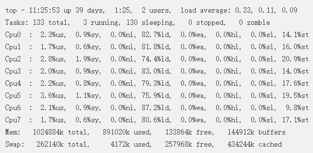

> 注意：Nginx默认没有开启利用多核cpu，我们可以通过增加worker_cpu_affinity配置参数来充分利用多核cpu的性能。cpu是任务处理，计算最关键的资源，cpu核越多，性能就越好。

 

## 一、nginx worker_processes 设置多少合适？

worker_processes最多开启8个，8个以上性能就不会再提升了，而且稳定性会变的更低，因此8个进程够用了；

 

## 二、nginx worker_cpu_affinity 如何设置？

cpu有多少个核？就有几位数，1代表内核开启，0代表内核关闭；

 

例如：我有一个服务器是最低配，8核CPU，nginx配置信息则如下：

1. worker_processes 8;
2. worker_cpu_affinity 00000001 00000010 00000100 00001000 00010000 00100000 01000000 10000000;

上面的配置表示：8核CPU，开启8个进程。

00000001表示开启第一个cpu内核，00000010表示开启第二个cpu内核......，依次类推；

有多少个核，就有几位数，1表示该内核开启，0表示该内核关闭。

 

## 三、配置实例

怕大家看不明白，因此下面再多举一些平常所用的配置实例，希望大家可以真正的看明白！

 

**2核CPU，开启2个进程**

1. worker_processes 2;
2. worker_cpu_affinity 01 10;

 

**2核CPU，开启4进程**

1. worker_processes 4;
2. worker_cpu_affinity 01 10 01 10;

 

**2核CPU，开启8进程**

1. worker_processes 8;
2. worker_cpu_affinity 01 10 01 10 01 10 01 10;

 

**8核CPU，开启2进程**

1. worker_processes 2;
2. worker_cpu_affinity 10101010 01010101;

说明：10101010表示开启了第2,4,6,8内核，01010101表示开始了1,3,5,7内核；

如果多个CPU内核的利用率都相差不多，证明nginx己经成功的利用了多核CPU。

测试结束后，CPU内核的负载应该都同时降低。