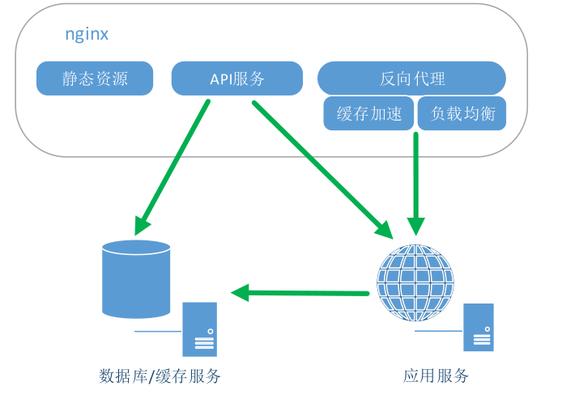

## Nginx的三个主要应用场景

1. 静态资源服务
   * 通过本地文件系统提供服务
2. 反向代理服务
   * Nginx的强大性能
   * 缓存
   * 负载均衡
3. API服务
   * OpenResty



## Nginx的优点

* 高并发，高性能
* 可扩展性好
* 高可靠性
* 热部署
* BSD许可证

## Nginx的组成

1. Nginx二进制可执行文件
   * 由各模块源码编译出的一个文件
2. `nginx.conf`配置文件
   * 控制`nginx`的行为
3. `access.log`访问日志
   * 记录每一条http请求信息
4. `error.log`错误日志
   * 定位问题

## 编译安装Nginx

### 下载Nginx

### 介绍各目录

### Configure

### 中间件介绍

### 编译

### 安装

## Nginx配置语法

1. 配置文件由指令与指令块构成
2. 每条指令以`;`分号结尾，指令与参数见以空格符号分隔
3. 指令块以`{ }`大括号将多条指令组织在一起
4. `include`语句允许组合多个配置文件以提升可维护性
5. 使用`#`符号添加注释，提高可读性
6. 使用`$`符号，使用变量
7. 部分指令的参数支持正则表达式

### Example

```nginx
http {
    include mime.types;
    upstream thwp {
        server 127.0.0.1:8080;
    }
    
    server {
        listen 443 http2;
        # Nginx配置语法
        limit_req_zone $binary_remote_addr zone=one:10m rate=1r/s;
        location ~* \.(gif|jpg|jpeg)$ {
            proxy_cache my_cache;
            expires 3m;proxy_cache_key $host$uri$is_args$args;
            proxy_cache_valid 200 304 302 1d;
            proxy_pass http://thwp;
        }
    }
}
```

### 配置参数

#### 时间单位

* ms：milliseconds
* s：seconds
* m：minutes
* h：hours
* d：days
* w：weeks
* M：months，30 days
* y：years，365 days

#### 空间单位

* b/B：bytes
* k/K：kilobytes
* m/M：megabytes
* g/G：gifabytes

### http配置的指令块

* http
* upstream
* server
* location

## Nginx命令行

1. 格式：`nginx -s reload`
2. 帮助：`-?` `-h`
3. 使用指定的配置温江：`-c`
4. 指定配置指令：`-g`
5. 指定运行目录：`-p`
6. 发送信号：`-s`
   * 立刻停止服务：`stop`
   * 优雅的停止服务：`quit`
   * 重载配置文件：`reload`
   * 重新开始记录日志文件：`reopen`
7. 测试配置文件是否有语法错误：`-t` `-T`
8. 打印`nginx`的版本信息、编译信息：`-v` `-V`

### 命令行演示

#### 重载配置文件

#### 热部署

#### 切割日志文件

## 静态资源服务演示

### http

### server

### location

### alias

### gzip

### threal pool

## Access日志演示

### Access format

### Go access

### Access log

## Todo

1.（必做）

编译安装Nginx写详细步骤

命令行演示写详细步骤

静态资源服务演示写详细步骤

Access日志演示写详细步骤

2.（可先不做）

TLS应用实践

OpenResty安装实践