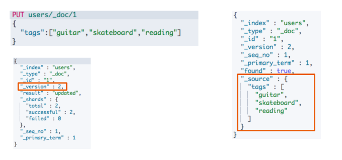
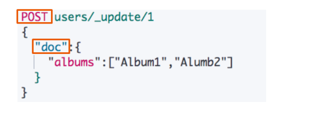
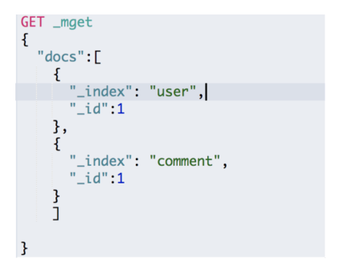
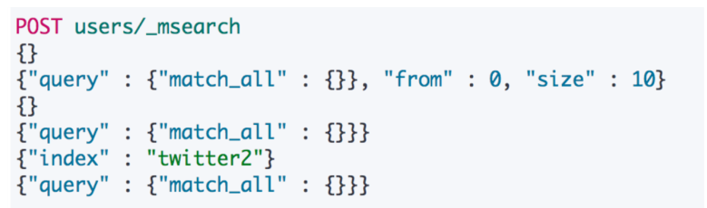
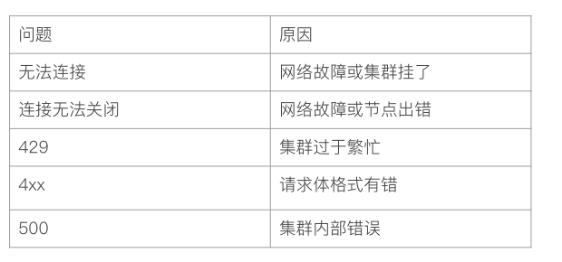

## 文档的CRUD

* Type名，约定都用_doc
* Create - 如果ID已经存在，会失败
* Index - 如果ID不存在，创建新的文档。否则，先删除现有的文档，再创建现有的文档，再创建新的文档，版本会增加
* Update - 文档必须已经存在，更新只会对相应字段做增量修改

### Create一个文档

* 支持自动生产文档id和指定文档id两种方式
* 通过调用"post /users/_doc"
  * 系统会自动生产document id
* 使用HTTP PUT user/create/1创建时，URI中显示指定_create，此时如果该id的文档已经存在，操作失败

### Get一个文档

* 找到文档，返回HTTP 200
  * 文档元信息
    * _index / _type /
    * 版本信息，同一个id的文档，即使被删除，version号也会不断增加
    * _source中默认包含了文档的所有原始信息
* 找不到文档，返回HTTP 404

### Index 文档

* Index和Create不一样的地方：如果文档不存在，就索引新的文档。否则现有文档会被删除，新的文档被索引。版本信息+1

### Update文档

* Update方法不会删除原来的文档，而是实现真正的数据更新
* Post方法 / Payload需要包含在"doc"中

## API的批量操作

### Bulk API

* 支持在一次API调用中，对不同的索引进行操作
* 支持四种类型操作
  * Index
  * Create
  * Update
  * Delete
* 可以在URI中指定Index，也可以在请求的Payload中进行
* 操作中单条操作失败，并不会影响其他操作
* 返回结果包括了每一条操作执行的结果

### 批量读取 - mget

批量操作，可以减少网络连接所产生的开销，提高性能

### 批量查询 - msearch

## 常见的错误返回

