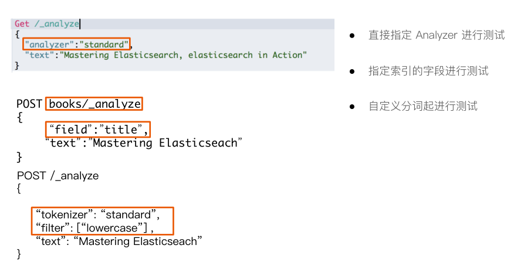
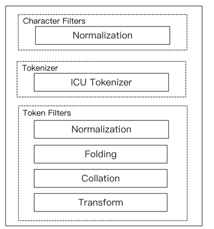
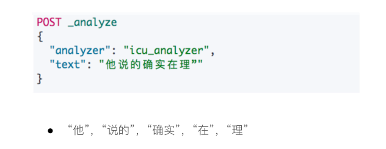

## Analysis

### Analysis与Analyzer

* Analysis - 文本分析是把全文本转换一系列单词（term/token）的过程，也叫分词
* Analysis是通过Analyzer来实现的
  * 可使用Elasticsearch内置的分析器/或者按需定制化分析器
* 除了在数据写入时转换词条，匹配Query语句时候也需要用相同的分析器对查询语句进行分析

### Analyzer的组成

* 分词器是专门处理分词的组件，Analyzer由三部分组成
  * Character Filters（针对原始文本处理，例如去除html）/ Tokenizer（按照规则切分为单词）/ Token Filter（将切分的单词进行加工，小写，删除stopwords，增加同义词）

举例

## Elasticsearch的内置分词器

* Standard Analyzer - 默认分词器，按词切分，小写处理
* Simple Analyzer - 按照非字母切分（符号被过滤），小写处理
* Stop Analyzer - 小写处理，停用词过滤（the ，a，is）
* Whitespace Analyzer - 按照空格切分，不转小写
* Keyword Analyzer - 不分词，直接将输入当做输出
* Patter Analyzer - 正则表达式，默认\W+（非字符分隔）
* Language - 提供了30多种常见语言的分词器
* Customer Analyzer  - 自定义分词器

### 使用_analyzer API

## 中文分词

### 分文分词的难点

* 中文句子，切分成一个一个词（不是一个个字）
* 英文中，单词有自然的空格作为分隔
* 一句中文，在不同的上下文，有不同的理解
  * 这个苹果，不大好吃 / 这个苹果，不大，好吃！

### ICU Analyzer

* 需要安装plugin
  * Elasticsearch-plugin install analysis-icu
* 提供了Unicode的支持，更好的支持亚洲语言

举例

### 常用的中文分词器

* IK
  * 支持自定义词库，支持热更新分词字典
  * https://github.com/medcl/elasticsearch-analysis-ik
* THUlAC
  * THU Lexucal Analyzer for Chinese，清华大学自然语言处理和社会人文计算实验室的一套中文分词器
  * https://github.com/microbun/elasticsearch-thulac-plugin