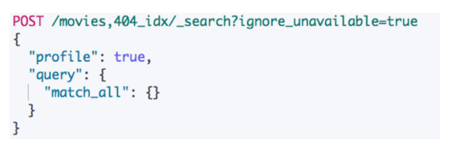
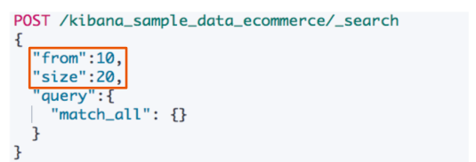
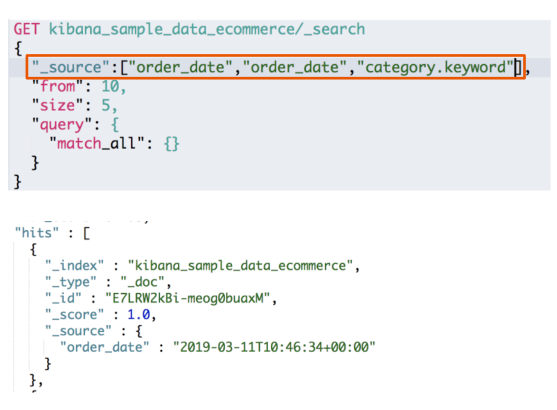
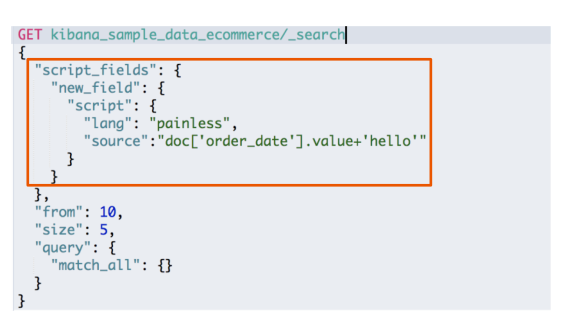
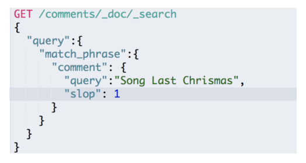

## Request Body Search

* 将查询语句通过HTTP Request Body发送给Elasticsearch
* Query DSL

举例

### 分页

* From从0开始，默认返回10个结果
* 获取靠后的翻页成本较高

### 排序

* 最好在"数字型"与"日期型"字段上排序
  * 因为对于多值类型或分析过的字段排序，系统会选一个值，无法得知该值

### _source filtering

* 如果\_source没有存储，那就只返回匹配的文档的元数据
* \_source支持使用通配符\_source["name\*","desc\*"]

### 脚本字段

* 用例：订单中有不同的汇率，需要结合汇率对，订单价格进行排序

### 使用查询表达式 - Match

* 默认使用term类型，或的关系

* 可以指定操作类型为AND

### 短语搜索 - Match Phrase

* slop参数表示，允许各个单词之间插入的单词个数

