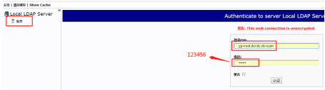
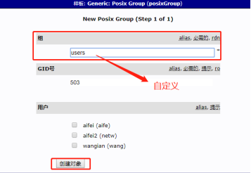
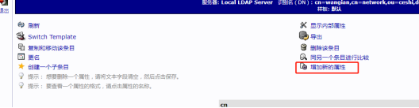
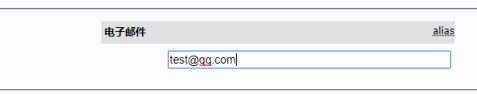

### 1.****在浏览器中打开****http://IP/phpldapadmin

### 2. 点击【Login】按钮，输入管理员密码。

 

 

### 3.****点击【****创建新条目****】.

 

 

### 4. 点击【****Generic: Postfix Group****】.

 

 

 

### 5. 输入【Users】, 点击【****创建对象****】

 

 

### 6. 点击【****提交****】

 

 

 

### 7. 下一步添加用户****，****点击刚才所创建的组【****u****sers】

### 8****. 点击【****创建一个子条目****】

 

 

### 9****. 点击【Generic: User Account】按钮。

 

 

### 10.****根据自己的情况，添加信息****然后点击【创建对象】

示例：

 

 

 

### 11. 点击【****提交****】

 

 

 

### 12.****点击****新增的用户，点击右侧****【****增加新的属性****】

 

 

 

### 13.****选择属性【Email】

 

 

### 14. 添好Email地址

示例如下。

 

 

15.点击【Update Object】