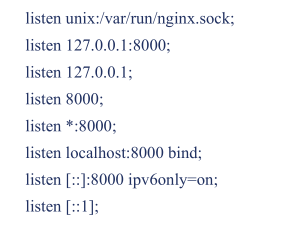
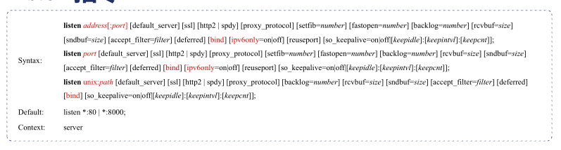

## 1 Listen 指令

**Example Configuration**



**Directives**



## 2 server_name指令

### 2.1 规则

* 指令后可以跟多个域名，第一个是主域名
* *泛域名：进支持在最前或最后（`server_name *.baiud.com;`）
* 正则表达式：加`~`前缀 (`server_name  www.taohui.tech ~^www\d+\.taohui\.tech$;`)

**用正则表达式创建变量：用小括号()**

示例

```nginx
server {
    server_name ~^(www\.)?(.+)$;
    location / {
        root /sites/$2;
    }
}
server {
    server_name ~^(www\.)?(?<domain>.+)$;
    locatoin / {
        root /sites/$domain;
    }
}
```

**其他**

* .taohui.tech 可以匹配 taohui.tech *.taohui.tech
* _ 匹配所有
* “” 匹配没有传递Host头部

### 2.2 匹配顺序

1）精准匹配

2）*在前的泛域名

3）*在后的泛域名

4）按文件中的顺序匹配正则表达式域名

5）default server 匹配第1个，listen指定default