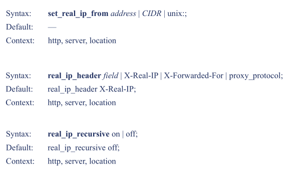
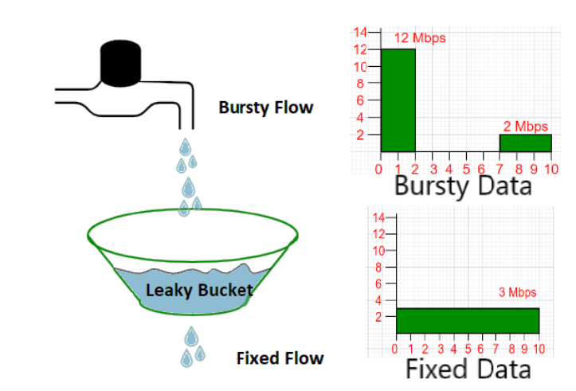
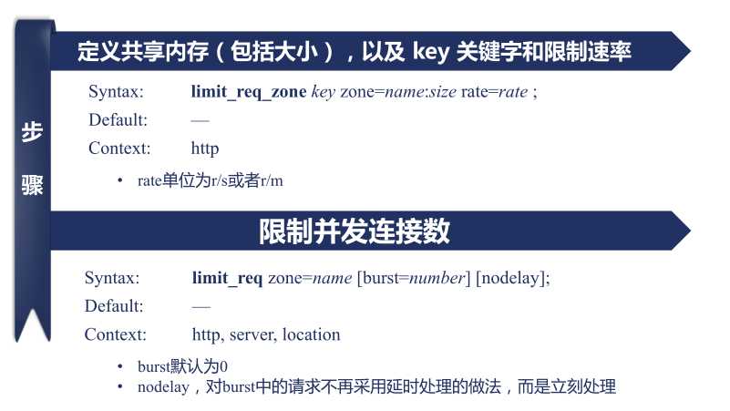
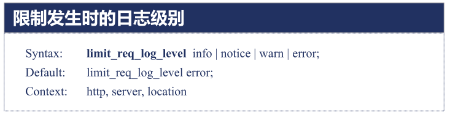

## 1 Module ngx_http_gzip_module

该`ngx_http_gzip_module`模块是一个使用“gzip”方法压缩响应的过滤器。这通常有助于将传输数据的大小减少一半甚至更多。

> 使用SSL / TLS协议时，压缩的响应可能会受到 [BREACH](https://en.wikipedia.org/wiki/BREACH)攻击。

在实际的应用中我们发现压缩的比率往往在 3 到 10 倍，也就是本来 50k 大小的页面，采用压缩后实际传输的内容大小只有 5 至 15k 大小，这可以大大节省服务器的网络带宽，同时如果应用程序的响应足够快时，网站的速度瓶颈就转到了网络的传输速度上，因此内容压缩后就可以大大的提升页面的浏览速度。

### 1.1 Example Configuration

```
gzip on;
gzip_buffers 4 8k;
gzip_comp_level 6;
gzip_disable "MSIE [1-6]\.";
gzip_http_version 1.1;
gzip_min_length 1000;
gzip_proxied any;
gzip_vary on;
gzip_types text/plain text/css application/javascript application/x-javascript text/xml application/xml application/xml+rss text/javascript application/json image/jpeg image/gif image/png image/jpg;
```

### 1.2 Directives

**gzip**

```
Syntax:	gzip on | off;
Default: gzip off;
Context:	http, server, location, if in location
```

启用或禁用gzipping响应。

**gzip_buffers**

```
Syntax:	gzip_buffers number size;
Default: gzip_buffers 32 4k|16 8k;
Context:	http, server, location
```

设置用于压缩响应的缓冲区`*number*`和`*size*`。默认情况下，缓冲区大小等于一个内存页面。这是4K或8K，具体取决于平台。

**gzip_comp_level**

```
Syntax:	gzip_comp_level level;
Default: gzip_comp_level 1;
Context:	http, server, location
```

设置`level`响应的gzip压缩。可接受的值范围为1到9。

推荐6压缩级别(级别越高,压的越小,越浪费CPU计算资源)

**gzip_disable**

```
Syntax:	gzip_disable regex ...;
Default: —
Context:	http, server, location
```

对具有与任何指定正则表达式匹配的“User-Agent”标头字段的请求禁用gzipping响应。

特殊掩码“ `msie6`”（0.7.12）对应于正则表达式“ `MSIE [4-6]\.`”，但效果更快。

**gzip_http_version**

```
Syntax:	gzip_http_version 1.0 | 1.1;
Default: gzip_http_version 1.1;
Context:	http, server, location
```

设置压缩响应所需的最低HTTP请求版本。

99.99%的浏览器基本上都支持gzip解压了，所以可以不用设这个值,保持系统默认即可。

**gzip_min_length**

```
Syntax:	gzip_min_length length;
Default: gzip_min_length 20;
Context:	http, server, location
```

设置将被gzip压缩的响应的最小长度。长度仅由“Content-Length”响应头字段确定。

**gzip_proxied**

```
Syntax:	gzip_proxied off | expired | no-cache | no-store | private | no_last_modified | no_etag | auth | any ...;
Default: gzip_proxied off;
Context:	http, server, location
```

根据请求和响应启用或禁用对代理请求的响应的gzipping。请求被代理的事实由“Via”请求头字段的存在确定。该指令接受多个参数：

* `off`：禁用所有代理请求的压缩，忽略其他参数;
* `expired`：如果响应头包含“Expires”字段，其值为禁用缓存，则启用压缩;
* `no-cache`：如果响应头包含带有“ `no-cache`”参数的“Cache-Control”字段，则启用压缩;
* `no-store`：如果响应头包含带有“ `no-store`”参数的“Cache-Control”字段，则启用压缩;
* `private`：如果响应头包含带有“ `private`”参数的“Cache-Control”字段，则启用压缩;
* `no_last_modified`：如果响应头不包含“Last-Modified”字段，则启用压缩;
* `no_etag`：如果响应头不包含“ETag”字段，则启用压缩;
* `auth`：如果请求标头包含“授权”字段，则启用压缩;
* `any`：为所有代理请求启用压缩。

**gzip_types**

```
Syntax:	gzip_types mime-type ...;
Default:	gzip_types text/html;
Context:	http, server, location
```

除了“ `text/html`” 之外，还允许对指定的MIME类型进行gzipping响应。特殊值“ `*`”匹配任何MIME类型。

> 图片类型的文件压缩比例很小，可以不忽略不计，所以图片不建议压缩

**gzip_vary**

```
Syntax:	gzip_vary on | off;
Default:	gzip_vary off;
Context:	http, server, location
```

如果指令[gzip](http://nginx.org/en/docs/http/ngx_http_gzip_module.html#gzip)， [gzip_static](http://nginx.org/en/docs/http/ngx_http_gzip_static_module.html#gzip_static)或[gunzip](http://nginx.org/en/docs/http/ngx_http_gunzip_module.html#gunzip) 处于活动状态， 则启用或禁用插入“Vary：Accept-Encoding”响应头字段 。

### 1.3 常见问题

**调用接口时，返回json乱码的问题**

原因：

gzip是nginx的压缩格式。（gzip是浏览器可接受的压缩格式） 但是我们调用接口并没有通过浏览器。所以没有办法对返回的结果进行解压。

解决办法：

* 在响应的`location`中关闭gzip
* 或者让后端改代码，增加判断，然后用gzip流的方式进行解压读取

## 2 Module ngx_http_log_module

### 2.1 Example Configuration

```nginx
log_format compression '$remote_addr - $remote_user [$time_local] '
                       '"$request" $status $bytes_sent '
                       '"$http_referer" "$http_user_agent" "$gzip_ratio"';

access_log /spool/logs/nginx-access.log compression buffer=32k;
```

### 2.2 access_log指令

```
Syntax:	access_log path [format [buffer=size] [gzip[=level]] [flush=time] [if=condition]];
		access_log off;
Default:	access_log logs/access.log combined;
Context:	http, server, location, if in location, limit_except
```

### 2.3 log_format指令

```
Syntax:	log_format name [escape=default|json|none] string ...;
Default:	log_format combined "...";
Context:	http
```

## 3 Rewrite模块

### 3.1 return指令

```
Syntax:	return code [text];
		return code URL;
		return URL;
Default:	—
Context:	server, location, if
```

**返回状态码**

* nginx自定义
  * 444：关闭连接
* HTTP1.0标准
  * 301：http1.0永久重定向
  * 302：临时重定向，禁止被缓存
* HTTP1.1标准
  * 303：临时重定向，允许改变方法，禁止被缓存
  * 307：临时重定向，不允许改变方式，禁止被缓存
  * 308：永久重定向，不允许改变方法

**示例**

```nginx
server {
    server_name wiki.clay-wangzhi.com;
    listen 8080;
    
    root html/;
    error_page 404/403.html;
    return 403;
    location / {
        return 404 "find nothing!";
    }
}
```

**return指令与errror_page**


### 3.2 rewrite指令

```
Syntax:	rewrite regex replacement [flag];
Default:	—
Context:	server, location, if
```

**功能**

* 将regex指定的url替换成replacement这个新的url

  可以使用正则表达式及变量提取

* 当replacement以http://或者https://或者$schema开头，则直接返回302重定向

* 替换后的url根据flag指定的方式进行处理

  如果在同一级配置块中存在多个rewrite规则，那么会自下而下逐个检查；被某条件规则替换完成后，会重新一轮的替换检查，因此，隐含有循环机制；[flag]所表示的标志位用于控制此循环机制；

  * last：
    * 浏览器地址栏URL地址不变
    * 用replacement这个URI进行新的location匹配，重写完成后停止对当前URI在当前location中后续的其它重写操作，而后对新的URI启动新一轮重写检查；提前重启新一轮循环；
  * beak：
    * 浏览器地址栏URL地址不变
    * break指令停止当前脚本指令的执行，等价于独立的break指令,重写完成后停止对当前URI在当前location中后续的其它重写操作，而后直接跳转至重写规则配置块之后的其它配置；结束循环；

  * redirect：
    * 浏览器地址会显示跳转后的URL地址
    * 返回302临时重定向，
  * permanent：
    *  浏览器地址会显示跳转后的URL地址
    *  返回301永久重定向

> 功能一句话概括为：使用nginx提供的全局变量或自己设置的变量，结合正则表达式和标志位实现url重写以及重定向。

**示例1**

```nginx
        root html/;
        location /first {
            rewrite /first(.*) /second$1 last;
            return 200 'first!';
        }

        location /second {
            rewrite /second(.*) /third$1 break;
            return 200 'second!';
        }

        location /third {
            return 200 'third!';
        }
```

访问/first/1.txt的结果为：`html/third/1.txt`的内容

访问/second/1.txt的结果为：`html/third/1.txt`的内容

访问/third/1.txt的结果为：`third`的内容

**示例**2

```nginx
# http://www.test.com/test/abc/1.html ⇒ http://www.test.com/ccc/bbb/2.html
location /test {
    rewrite .* /ccc/bbb/2.html permanent;
}

# http://www.test.com/2015/ccc/bbb/2.html ==> http://www.test.com/2014/ccc/bbb/2.html
location /2015 {
    rewrite ^/2015/(.*)$ /2014/$1 permanent;
}

# http://www.test.com/2015/ccc/bbb/2.html  ==> http://jd.com/index.php
location /2015 {
    if ($host ~* test.com) {
        rewrite .* http://www.jd.com/index.php permanent;
    }
}

# http://www.test.com/kkk/1.html ==> http://jd.com/kkk/1.html
location / {
    root html;
    index index.html index.htm;
    if ($host ~* test.com) {
        rewrite .* http://www.jd.com/$request_uri permanent;
    }
}

# 有时候在访问一个二级子目录时会出现目录后的/无法补齐，如：
#  elinks --dump www.test.com/www  无法访问
#  elinks --dump www.test.com/www/可以访问 
if (-d $request_filename) {
    rewrite ^(.*)([^/])$ http://$host$1$2/ permanent;
}
# ^/(.*)([^/])$表示以/符号开始并紧跟着任何字符，同时不是以/为结束的字符串，在我的url中，(.*)表示的ww，([^/])表示的w

# http://www.test.com/login/robin.html     ==>  http://www.test.com/reg/login.php?user=robin
location /login {
    rewrite ^/login/(.*)\.html$ /reg/login.php?user=$1 permanent;
}

# http://www.test.com/uplook/10-10-10.html  ==>  http://www.test.com/uplook/10/10/10.html 
location /uplook {
    rewrite ^/uplook/([0-9]+)-([0-9]+)-([0-9]+)\.html$ /uplook/$1/$2/$3.html permanent;
}

# set 指令是用于定义一个变量，并且赋值。应用于server,location,if环境。
# http://robin.test.com ==> http://www.test.com/robin
# http://zorro.test.com ==> http://www.test.com/zorro
if ($host ~* "^www.test.com$") {
    break;
}
if ($host ~* "^(.*)\.test\.com$") {
    set $user $1;
    rewrite .* http://www.test.com/$user permanent;
}
```

> last 一般写在server和if中，而break一般使用在location中

### 3.3 if指令

```
Syntax:	if (condition) { ... }
Default:	—
Context:	server, location
```

规则：条件condition为真，则执行大括号内的指令；遵循值指令的继承规则

**if指令的条件表达式**

* 检查变量为空或者值是否为0，直接使用
  * 当表达式只是一个变量时，如果值为空或任何以 0 开头的字符串都会当做 false
* 将变量与字符串做匹配，使用=或者!=
* 将变量与正则表达式做匹配
  * 大小写敏感，~或者!~
  * 大小写不敏感，~\*或者!~\*
* 检查文件是否存在，使用-f或者!-f
* 检查目录是否存在，使用-d或者!-d
* 检查文件、目录、软连接是否存在，使用-e或者!-e
* 检查是否为可执行文件，使用-x或者!-x

**示例**

```nginx
if ($http_user_agent ~ MSIE) {
    rewrite ^(.*)$ /msie/$1 break;
}
if ($http_cookie ~* "id=([^;]+)(?:;|$)") {
    set $id $1;
}
if ($repuest_method = POST) {
    return 405;
}
if ($slow) {
    limit_rate 10k;
}
if ($invalid_referer) {
    return 403;
}
```

### 3.4 rewrite_log指令

```
Syntax: rewrite_log on | off;
Default:    rewrite_log off;
Context:    http, server, location, if
```

## 4 realip模块

* 默认不会编译进Nginx，通过`--with-http_reaip_module`启用功能
* 功能：修改客户端地址
* 指令：set_real_ip_from、real_ip_header、real_ip_recursive
* 变量：reaip_remote_addr、reaip_remote_port

### 4.1 Directives



## 5 limit_conn模块

生效阶段：NGX_HTTP_PREACCESS_PHASE阶段

生效范围：全部worker进程（基于共享内存），进入preaccess阶段前不生效，限制的有效性取决于key的设计：依赖postread阶段的realip模块取到真实ip

### 5.1 指令


## 6 limit_req模块




### 6.1 指令





限制发生时向客户端返回的错误码

```
Syntax:	limit_req_status code;
Default:	limit_req_status 503;
Context:	http, server, location
```

> limit_req 与 limit_conn 配置同时生效时， limit_req有效

### 6.2 Example

```nginx
http {
    geo $limit {
        default 1;
        10.0.0.0/8 0;
        192.168.0.0/64 0;
    }
    
    map $limit $limit_key {
        0 "";
        1 $binary_remote_addr;
    }
    
    limit_req_zone $limit_key zone=req_zone:10m rate=5r/s;
    
    server {
        location / {
            limit_req zone=req_zone burst=10 nodelay;
        }
    }
}
```

这个例子同时使用了geo和map指令。geo块将给在白名单中的IP地址对应的$limit变量分配一个值0，给其它不在白名单中的分配一个值1。然后我们使用一个映射将这些值转为key，如下：

如果$limit变量的值是0，$limit_key变量将被赋值为空字符串

如果$limit变量的值是1，$limit_key变量将被赋值为客户端二进制形式的IP地址

两个指令配合使用，白名单内IP地址的$limit_key变量被赋值为空字符串，不在白名单内的被赋值为客户端的IP地址。当limit_req_zone后的第一个参数是空字符串时，不会应用“流量限制”，所以白名单内的IP地址(10.0.0.0/8和192.168.0.0/24 网段内)不会被限制。其它所有IP地址都会被限制到每秒5个请求。

limit_req指令将限制应用到**/**的location块，允许在配置的限制上最多超过10个数据包的突发，并且不会延迟转发。

> 参考链接：
>
> https://www.jianshu.com/p/bbb51f727d46