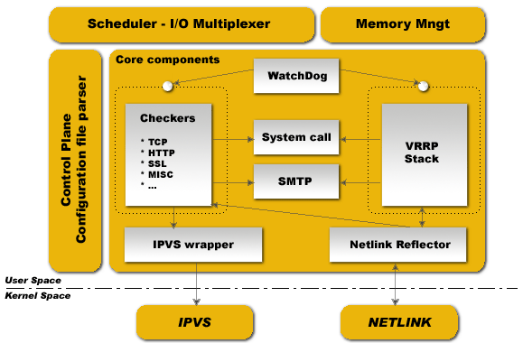

## keepalived简介

 keepalived是vrrp协议的实现，原生设计目的是为了高可用ipvs服务，keepalived能够配置文件中的定义生成ipvs规则，并能够对各RS的健康状态进行检测；通过共用的虚拟IP地址对外提供服务；每个热备组内同一时刻只有一台主服务器提供服务，其他服务器处于冗余状态，若当前在线的服务器宕机，其虚拟IP地址将会被其他服务器接替（优先级决定接替顺序），实现高可用为后端主机提供服务。

VRRP全称Virtual Router Redundancy Protocol，即[虚拟路由冗余协议](http://en.wikipedia.org/wiki/VRRP)。

虚拟路由冗余协议，可以认为是实现路由器高可用的协议，即将N台提供相同功能的路由器组成一个路由器组，这个组里面有一个master和多个backup，master上面有一个对外提供服务的vip（该路由器所在局域网内其他机器的默认路由为该vip），master会发组播，当backup收不到vrrp包时就认为master宕掉了，这时就需要根据[VRRP的优先级](http://tools.ietf.org/html/rfc5798#section-5.1)来[选举一个backup当master](http://en.wikipedia.org/wiki/Virtual_Router_Redundancy_Protocol#Elections_of_master_routers)。这样的话就可以保证路由器的高可用了。

## keepalived组件

  Keepalived组件介绍

* core：keepalived核心组件，主进程的启动和维护，全局配置等。

* vrrp stack：keepalived是基于vrrp协议实现高可用vps服务，vrrp则为相关子进程为其提供服务

* check：检测keepalived的健康状态相关进程 

* system call:系统调用

  watch dog:监控check和vrrp进程的看管者，check负责检测器子进程的健康状态，当其检测到master上的服务不可用时则通告vrrp将其转移至backup服务器上。

## mysql主主搭建

在主从的基础上，互换搭建一下就好了

不详细介绍

