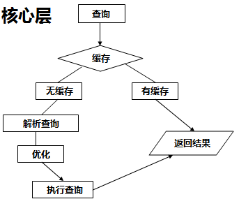
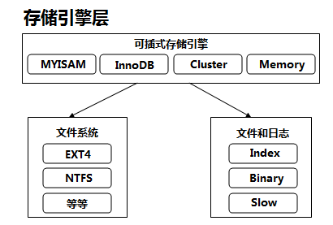

# 11 MySQL逻辑架构

## mysql架构

mysql架构分为三层：

1. 服务层：为客户请求做连接处理、授权认证、安全等
2. 核心层：查询解析，分析，优化，缓存，所有内建函数；存储过程，触发器，视图等
3. 存储引擎层：存储和提取数据以及事务处理

### 服务层

​         

### 核心层

​         

### 存储引擎层

​         

## 总图

​         