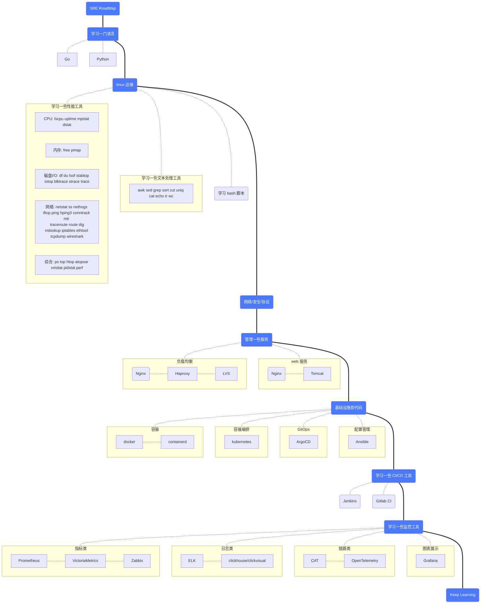

## SRE RoadMap

```mermaid
%%{
  init: {
    'themeVariables': {
      'mainBkg': '#e9e9fe',
      'nodeBorder': '#9672d6'
    }
  }
}%%
flowchart TB

	SRE(SRE RoadMap) === A(学习一门语言) ==== C(linux 运维) ==== D(网络/安全/协议) ==== E(管理一些服务) ==== F(基础设施即代码) ====  G(学习一些 CI/CD 工具) ==== H(学习一些监控工具) ==== I(Keep Learning)

  A -.- Go
  A -.- Python
	
	C -.- C1
  C -.- C2
  C -.- C3(学习 bash 脚本)
    
  subgraph C2[学习一些文本处理工具]
   txt["awk sed grep sort cut uniq cat echo tr wc"]
  end
  
  subgraph C1[学习一些性能工具]
		cpu["CPU: lscpu uptime mpstat dstat"]
		mem["内存: free pmap"]
		disk["磁盘I/O: df du lsof slabtop iotop blktrace strace trace"]
		network["网络: netstat ss nethogs iftop ping hping3 conntrack mtr \n traceroute route dig nslookup iptables ethtool tcpdump wireshark"]
		allin["综合: ps top htop atopsar vmstat pidstat perf"]
  end

	E -.- E1
	E -.- E2
	
	subgraph E2[web 服务]
		n1(Nginx) -.- Tomcat
		click n1 "https://clay-wangzhi.com/web/nginx"
		click Tomcat "https://clay-wangzhi.com/web/tomcat"
	end
	
  subgraph E1[负载均衡]
		n2(Nginx) -.- Haproxy -.- LVS
		click n2 "https://clay-wangzhi.com/web/nginx"
	end
	
	F -.- F1
	F -.- F2
	F -.- F3
	F -.- F4
	
	subgraph F4[配置管理]
		Ansible; click Ansible "https://clay-wangzhi.com/devops/ansible"
	end
	
	subgraph F3[GitOps]
		ArgoCD
	end
	
	subgraph F2[容器编排]
		kubernetes
	end

	subgraph F1[容器]
		docker -.- containerd
	end
	
	G -.- G1(Jenkins); click G1 "https://clay-wangzhi.com/devops/jenkins"
	G -.- G2(Gitlab CI)
	
	H -.- H1
	H -.- H2
  H -.- H3
	H -.- H4
	
  subgraph H4[图表展示]
		Grafana
	end
	
  subgraph H3[链路类]
		CAT -.- OpenTelemetry
	end
	
	subgraph H2[日志类]
		ELK -.- clickhouse/clickvisual
	end
	
  subgraph H1[指标类]
		Prometheus -.- VictoriaMetrics -.- Zabbix
	end
	
	class SRE h1;class A h1;class B h1;class C h1;class D h1;class E h1;class F h1;class G h1;class H h1;class I h1;
	classDef h1 fill:#4979FF,color:#fff
```

