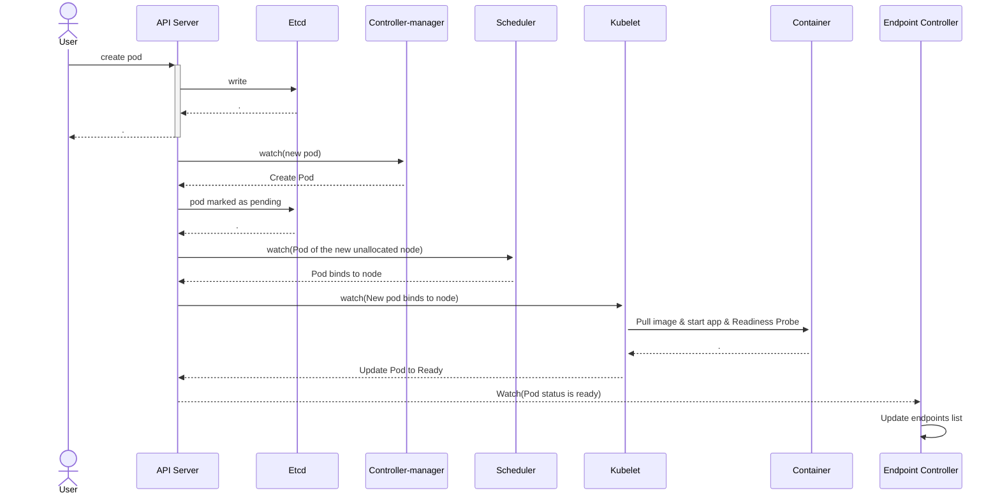
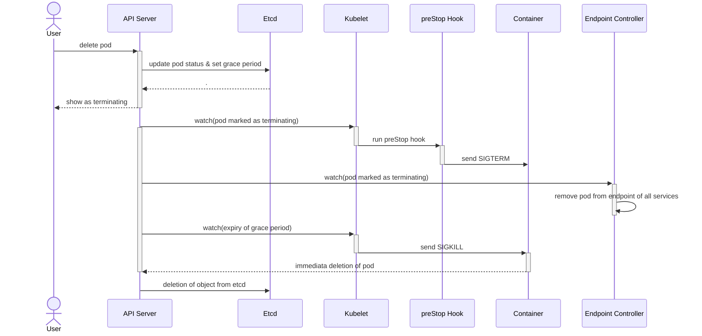

# 容器化后无损上下线解决方案

> 说明： 本文主要以 Spring Cloud 应用举例

## 1. 背景

**绝大数事故发生在应用上下线发布阶段**，所以要尽可能避免发布过程中由于应用自身代码问题对用户造成的影响。

业界发布规范：

- 可灰度（可以通过 Argo Rollout/OpenKruise 支持）
- 可观测（容器状态、容器速查大盘、发布/配置变更/K8s 事件、业务日志/业务埋点、jstack/jvm/gc、链路，主要是通过指标、事件、日志、链路几大类进行收集分析，后续可观测性会介绍具体方案及关键指标收集/汇聚/展示）
- 可回滚（应用维度的快照回滚）

但对于高并发大流量情况下的短时间流量有损问题却仍然无法解决，因此本文主要介绍**无损上下线**。

除了应用发布会涉及上下线，上片文章 [弹性伸缩落地实践](https://mp.weixin.qq.com/s?__biz=MzI4NzAxMjIzNw==&mid=2247483935&idx=1&sn=242b6495c513fb4996aae83f023b61d8&chksm=ebd566fddca2efeb7efd2efd2119a76e4ead35a6c323c8f388228ce6232d7f801af7bd424043#rd) 中提到的弹性伸缩也会涉及应用上下线。

## 2. 容器应用上下线流程分析

### 2.1 应用上线

#### 2.1.1 从 Eureka 注册中心维度看（服务间调用）

 

1. 服务提供者启动后，向 Eureka Server 注册自己信息并定期发送心跳以维持该服务的可用状态。
2. 服务消费者，默认每30s 向 Eureka Server 拉取一次最新的可用服务列表 。
3. 消费者正常调用新的提供者。

#### 2.1.2 从 Pod 维度看（域名调用）

 

> 说明： 
> 所有的组件只与 Apiserver 做交互，Apiserver 再把信息更新的 Etcd 中。
>
> 域名通过 Ingress 暴露，而 Ingress 直接监听的 Endpoints 的变化，所以流程图只画到了  Endpoint Controller。

1. 用户向 Kubernetes API server 发送创建（create/apply）指令。
2. Apiserver 接收到配置文件，进行校验后，将配置数据存储到 etcd 中。
3. Controller-manager 监听 Apiserver 的变化，检测到有新的 Pod 对象时，控制器创建 Pod 并将其状态设为 Pending。
4. Scheduler 也通过监听 Apiserver 的变化，发现有新的、尚未分配节点的 Pod。根据预选策略和优选策略，选择一个最适合的 Node 来运行新的 Pod。
5. Pod 被调度到对应的 Node 后，该 Node 上的 kubelet 组件则开始根据 Pod 配置文件，拉镜像、启动 app、就绪探针探测。
6. Kubelet 向 Apiserver  上报状态为 Reday， Apiserver 写入到 etcd 中
7. 控制器 Endpoint Controller 会监控 Pod 的状态，一旦 Pod 状态为 Ready 后，Endpoint Controller 会更新与 Pod 关联的 Service 内部的 Endpoint 列表，这允许流量被路由到新的Pod。

### 2.2 应用下线

#### 2.2.1 从 Eureka 注册中心维度看（服务间调用）

 

1. 消费者正常调用提供者
2. 提供者从注册中心下线
3. 服务消费者，默认每30s 向 Eureka Server 拉取一次最新的可用服务列表 。

#### 2.2.2 从 Pod 维度看（域名调用）


1. 用户向 Kubernetes API server 发送终止（delete）指令。
2. API server 将该删除请求写入后端的 Etcd 中，设置了 Pod 的状态为 “Terminating” 和一个默认的 30 秒的宽限期。
3. 当 Pod 的状态发生改变时，Kubernetes API server 会向所有监听这类事件的 clients 发送通知，包括 Kubelet 和 Endpoint Controller。
4. Endpoint Controller 在收到通知后会迅速地将 Pod 从对应的 Service 的 endpoint 中移除，防止新的请求被路由到这个正在终止的 Pod。
5. Kubelet 在接收到删除 Pod 的通知后开始实行删除过程（和步骤4并行）。
6. 如果在 Pod 的 yaml 定义中明确了 preStop 生命周期钩子，那么在容器完全删除前，Kubelet 会先执行这个 preStop 钩子中定义的任务。这个生命周期钩子允许我们在容器完全退出之前执行一些 “断电前预处理” 的清理工作。
7. 在 preStop 执行完成之后，Kubelet 发送 SIGTERM 信号给 Pod 中的每个容器，使它们能优雅地关闭。
8. 如果某个容器在规定的宽限期内没有关闭，kubelet 将发送 SIGKILL 信号，强行关闭该容器。
9. Pod 期满，将被 kubelet 清理，并从 etcd 完全移除。


## 3. 现状遇到的问题

### 3.1 消费者无法及时感知生产者已下线

开源 eureka 中 ，消费者 默认每 30s， 去注册中心查看一次 最新实例列表。 Pod 下线后，消费者可能30s后才感知到，这时候请求到已下线的 Pod 中，会发生 请求报错。

### 3.2 初始化慢

HPA 触发扩容时，流量太大，初始化完成慢，导致大量请求阻塞、超时、资源耗尽，Pod 自动重启

### 3.3 注册太早

服务存在异步资源加载问题，当服务还未初始化完全就被注册到注册中心，导致调用时资源未加载完毕出现请求响应慢、调用超时报错等现象。

### 3.4 发布态与运行态未对⻬

使用Kubernetes 的滚动发布功能进行应用发布，由于 Kubernetes的滚动发布一般关联的就绪检查机制，是通过检查应用特定接口 状态码是否返回200作为应用就绪的标志来触发下一批次的实例发布，但在微服务应用中只有当应用完成了服务注册才可对外提供服务调用。因此某些情况下会出现新应用还未注册到注册中心，老应用实例就被下线，导致无服务可用。

## 4. 解决方案

### 4.1 无损下线

对应 3.1 中的情况，解决方案主动通知+自适应等待

#### 4.1.1 主动通知

 

服务提供者 B 中某个实例在下线时为避免主动在注册中心中注销的服务实例状态无法实时被上游消费者 A 感知到，从而导致调用已下线实例的问题。在接收到下线命令即将下线前，提供者 B 对于在等待下线阶段内收到的请求，在其返回值中都增加上特殊标记让服务消费者接收到返回值并识别到相关标志后主动拉取一次注册中心服务实例从而实时感知 B 实例最新状态，从而达到服务提供者的下线状态能够被服务消费者实时感知。

具体方案：可使用阿里开源的 nacos 作为新的注册中心，替换掉 eureka， nacos 是基于事件发布订阅模式，且为长连接

#### 4.1.2 自适应等待

在并发度不高的场景下，主动通知方法可以解决绝大部分应用下线流量有损问题。但对于高并发大流量应用下线场景，如果主动通知完，可能仍然存在一些在途请求需要待下线应用处理完才能下线否则这些流量就无法正常被响应。为解决该类在途请求问题，可通过给待下线应用在下线前通过自适应等待机制在处理完所有在途请求后，再下线以实现流量无损。

 

自适应等待机制是通过待下线应用统计应用中是否仍然存在未处理完的在途请求，来决定应用下线的时机，从而让待下线应用在下线前处理完所有剩余请求。

具体方案：中间件通过框架实现 shutdownhook，服务框架在监听到 shutdownhook 后，在自定义的事件 ContextClosedEvent 监听中处理实例从注册中心下线；置服务实例状态为OUT_OF_SERVICE，然后线程睡眠20s，最后从注册中心删除实例；执行Spring容器内bean的销毁；60s（terminationGracePeriodSeconds）后不论当前进程是否有正在处理的任务，k8s 的宽限期到后，kubelet 将发送 SIGKILL 信号，强行关闭该容器。

yaml 关键信息如下：

> 说明：最好在 preStop 给应用发送 SIGTERM 信号，因为 kubelet 发起的 SIGTERM 信号可能不起作用，原因是 1 号进程可能不是应用启动进程（比如 CMD 是启动脚本）

```yaml
        readinessProbe:
          failureThreshold: 3
          httpGet:
            path: /healthz
            port: 9000
            scheme: HTTP
          initialDelaySeconds: 30
          periodSeconds: 2
          successThreshold: 2
          timeoutSeconds: 2
        lifecycle:
          preStop:
            exec:
              command:
              - /bin/sh
              - -c
              - sleep 15 && /usr/bin/killall java
      terminationGracePeriodSeconds: 60
```

### 4.2 无损上线

#### 4.2.1 延迟注册

对应 3.3 中的情况，解决方案延迟注册

对于初始化过程需要异步加载资源的复杂应用启动过程，由于注册通常与应用初始化过程同步进行，从而出现应用还未完全初始化就已经被注册到注册中心供外部消费者调用，此时直接调用由于资源未加载完成可能会导致请求报错。通过设置延迟注册，可让应用在充分初始化后再注册到注册中心对外提供服务。

具体方案：中间件通过框架改造将所有bean加载完成后，再将实例注册到注册中心

#### 4.2.2 小流量服务预热

对应 3.2中的情况，解决方案小流量服务预热

在线上发布场景下，很多时候刚启动的冷系统直接处理大量请求，可能由于系统内部资源初始化不彻底从而出现大量请求超时、阻塞、报错甚至导致刚发布应用宕机等线上发布事故出现。

 


具体方案：中间件框架改造实现，依赖上下游都需要改造，简单来说默认上游调用下游是负载均衡的，针对刚启动的下游服务把权重设置低一些，随着时间的推移，逐渐变大

#### 4.2.3 就绪检查

对应 3.4中的情况，解决方案 k8s 就绪检查 和 注册中心状态对齐

具体方案： 举例 /healthz 为应用的readinessProbe 的探测 URL，则当 /healthz 返回 200 时，服务应该已经注册到了注册中心

#### 4.2.4 无损上线整体方案

 

## 5 总结

|          | 问题                           | 解决方案                                              |
| :------- | :----------------------------- | :---------------------------------------------------- |
| 无损下线 | 消费者无法及时感知生产者已下线 | 主动通知+自适应等待（Nacos + shutdownhook + preStop） |
| 无损上线 | 注册太早                       | 延迟注册                                              |
| 无损上线 | 初始化慢                       | 小流量服务预热                                        |
| 无损上线 | 发布态与运行态未对⻬           | k8s 就绪检查 和 注册中心状态对齐                      |

参考链接：

- [微服务治理技术白皮书](https://developer.aliyun.com/ebook/7565?spm=a2c6h.26392470.ebook-read.11.5afc5fd4jB4uZr)


附录：

mermaid 源代码，方便修改流程图







