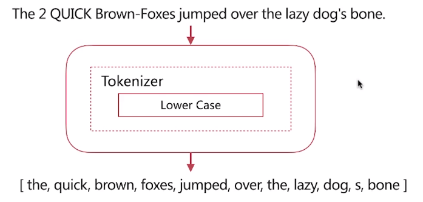
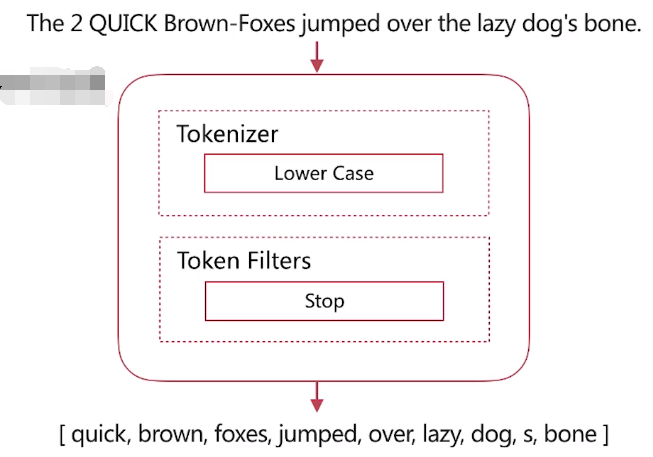
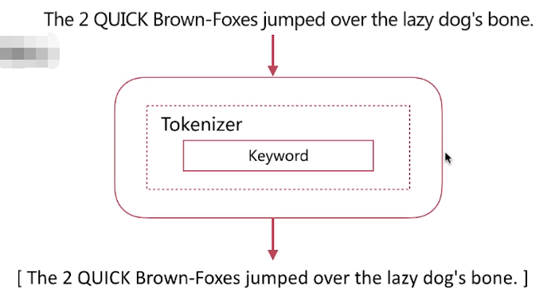
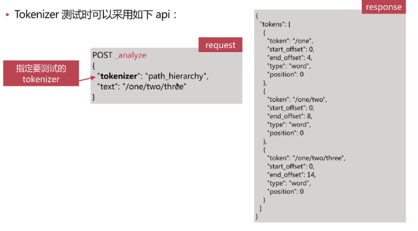
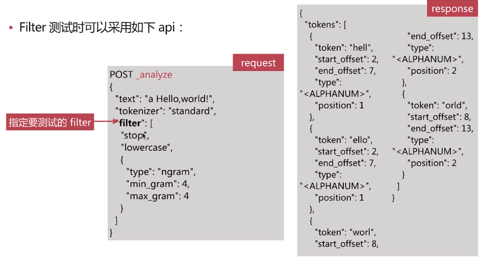

## Elasticsearch分词

### 分词相关概念

* 分词：是指将文本转换成一系列单词（term or token）,也可以叫做文本分析，在es里面称为Analysis。
* 分词器：是es中专门处理分词的组件，英文为Analyzer，它的组成如下：
  * Character Filters：针对原始文本进行处理，比如去除html特殊标记符
  * Tokenizer：将原始文本按照一定规则切分为单词
  * Token Filters：针对tokenizer处理完成的单词，再加工，比如转小写、删除或新增等处理

### 使用场景

* 创建或更新文档时（Index Time），会对相应的文档进行分词处理
* 查询时（SearchTime），会对查询语句进行分词

#### 索引时

* 索引时分词是通过配置Index Mapping中每个字段的analyzer属性实现的，不指定分词时，默认使用standard，如下

#### 查询时

* 查时分词的指定方式有如下几种:
  * 查询的时候通过analyzer指定分词器
  * 通多index mapping设置search_analyzer实现

### Analyze API

* es提供了一个测试分词的api接口，方便验证分词效果，endpoint是_analyze
  * 可以直接指定analyzer进行测试
  * 可以直接指定索引中的字段进行测试
  * 可以自定义分词器进行测试

### 预定义的分词器

* es自带如下的分词器

  * Standard
  * Simple
  * Whitespace
  * Stop
  * Keyword
  * Pattern
  * Language

#### Standard Analyzer

- 默认分词器
- 其组成如图，特性为：
  - 按词切分，支持多语言
  - 小写处理

#### Simple Analyzer

- 其组成如图，特性为：
  - 按照非字母切分
  - 小写处理

#### Whitespace Analyzer

* 其组成如图，特性为：
  * 按照空格切分

#### Stop Analyzer

* Stop Word 指预期助词等修饰性的词语，比如the、an、的、这等等
* 其组成如图，特性为：
  * 相比Simple Analyzer多了Stop Word处理

#### KeyWord Analyzer

- 其组成如图，特性为：
  - 不分词，直接将输入作为一个单词输出

#### Pattern Analyzer

* 其组成如图，特性为：
  * 通过正则表达式自定义分割符
  * 默认是\W+，即非字词的符号作为分隔符

### 自定义分词

#### Tokernizer

- 将原始文本按照一定规则切分为单词（term or token）
- 自带的如下：
  - standard 按照单词进行分割
  - letter按照非字符类进行分割
  - whitespace 按照空格进行分割
  - UAX URL Email按照standard分割，但不会分割邮箱和url
  - NGram和Edge NGram连词分割
  - Path Hierarchy按照文件路径进行切割

#### Character Filters

- 在Tokenizer之前对原始文本进行处理，比如增加、删除或替换字符等
- 自带的如下：
  * HTML Strip 去除html标签和转换html实体
  * Mapping进行字符替换操作
  * Pattern Replace进行正则匹配替换
- 会影响后续tokenizer解析的postion和offset信息

#### Token Filters

- 对于tokenizer输出的单词（term）进行增加、删除、修改等操作
- 自带的如下：
  - lowercase将所有term转换为小写
  - stop删除stop words
  - NGram和Edge NGram连词分割
  - Synonym添加近义词的term

#### API

* 自定义分词需要在索引的配置中设定，如下所示：

### 中文分词

* 难点
  * 中文分词指的是将一个汉字序列切分成一个一个单独的词。在英文中，单词之间是以空格作为自然分界符，汉语中词没有一个形式上的分解符。
  * 上下文不同，分词结果迥异，比如交叉歧义问题，比如下面两种分词都合理
    * 乒乓球拍/卖/完了
    * 乒乓球/拍卖/完了

* 常用分词系统
  * IK
    * 实现中英文单词的切分，支持ik_smart、ik_maxword等模式
    * 可自定义词库，支持热更新分词词典
  * jieba
    * python中最流行的分词系统，支持分词和词性标注
    * 支持繁体分词、自定义词典、并行分词等

* 基于自然语言处理的分词系统
  * Hanlp
    * 由一系列模型与算法组成的Java工具包，目标是普及自然语言处理在生产环境中的应用
  * THULAC
    * THU Lexical Analyzer for Chinese，由清华大学自然语言处理与社会人文计算实验室研制推出的一套中文词法分析工具包，具有中文分词和词性标注功能

### 分词使用建议

* 明确字段是否需要分词，不需要分词的字段就将type设置为keyword，可以节省空间和提高写性能
* 善用_analyze API，查看文档的具体分词结果
* 动手测试

