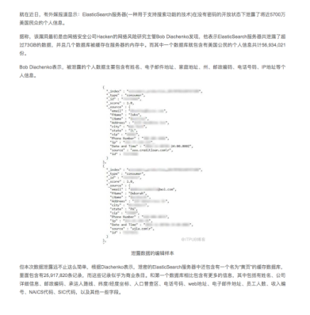
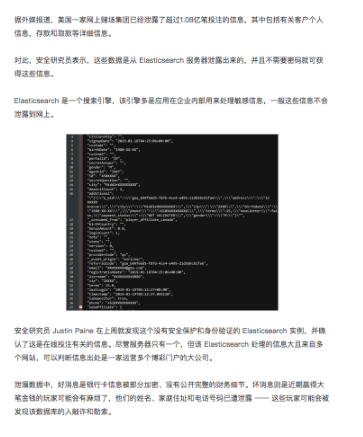
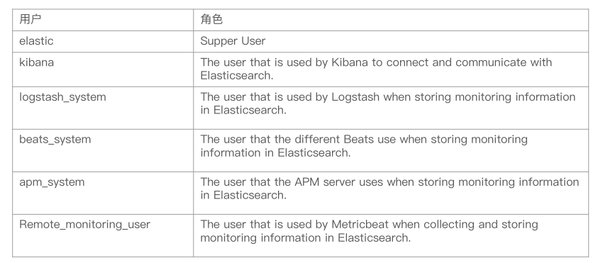
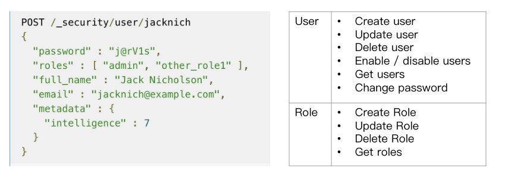

## 背景

### 数据信息泄漏

5700万用户数据泄漏



1.08亿条投注信息泄漏



### 原因分析

* Elasticsearch在默认安装后，不提供任何形式的安全防护
* 错误的配置信息导致公网可以访问ES集群
  * 在elasticsearch.yml文件中，server.host被错误的配置为0.0.0.0

## 数据安全性的基本需求

* 身份认证
  * 鉴定用户是否合法
* 用户鉴权
  * 指定用户可以访问哪个索引
* 传输加密
* 日志审计

## 一些免费的方案

* 设置Nginx反向代理，用户，密码 登录nginx
* 安装免费的Security插件
  * Search Guard - https://search-guard.com/
  * ReadOnly REST - https://github.com/sscarduzio/elasticsearch-readonlyrest-plugin
* X-Pack的Basic版
  * 从ES 6.8 & ES 7.0开始，Security纳入x-pack的Basic版本中，免费使用一些基本的功能
  * https://www.elastic.co/cn/what-is/elastic-stack-security

### Authentication - 身份认证

* 认证体系的几种类型
  * 提供用户名和密码
  * 提供秘钥或Kerberos票据
* Realms： X-pack中的认证服务
  * 内置Realms（免费）
    * File/Native（用户名密码保存在Elasticsearch）
  * 外部Realms（收费）
    * LDAP / Active Diretory / PKI / SAML / Kerberos

### RBAC - 用户鉴权

* 什么是RBCA: Role Based Access Control，定义一个角色，并分配一组权限。权限包括索引级，字段级，集群级的不同的操作。然后通过将角色分配给用户，使得用户拥有这些权限
  * User： The authenticated User
  * Role：A named set of permisssions
  * Permission：A set of one or more privileges against a secured resource
  * Privilege：A named group of 1 or more actions that user may execute against a secured resource

### Privilege

* Cluster Privileges
  * all / monitor / manager / manage_index / manage_index_template / manage_rollup
* Indices Privileges
  * all / create / create_index / delete / delete_index / index / manage / read / write / view_index_metadata

### 创建内置的用户和角色



#### 使用Security API创建用户



### 开启并配置X-pack的认证与鉴权

* 修改配置文件，打开认证与授权

```
bin/elasticsearch -E node.name=node0 -E cluster.name=geektime -E path.data=node0_data -E http.port=9200 -E xpack.security.enabled=true
```

* 创建默认的用户和分组

```
bin/elasticsearch-password interactive
```

* 当集群开启身份认证之后，配置Kibana
* Demo
  * 创建一个Role，配置为对某个索引只读权限 / 创建一个用户，把用户加入Role

#### 配置Kibana

* 修改kibana.yml

```
elasticsearch.username: "kibana"
elasticsearch.password: "changeme"
```

