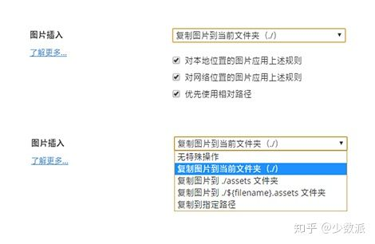
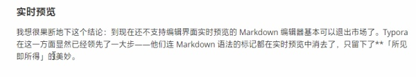
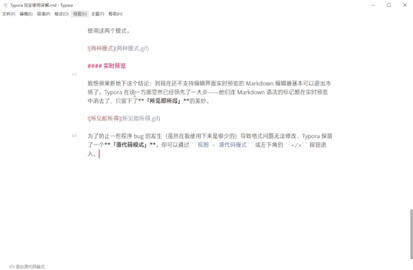
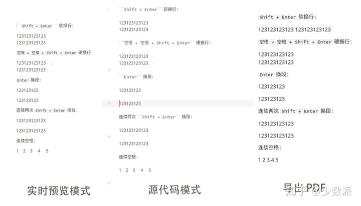
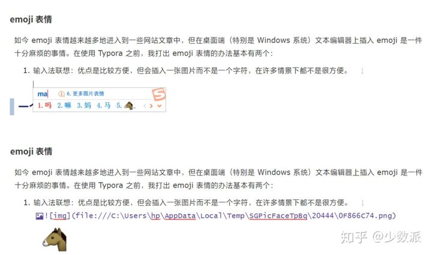
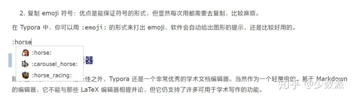
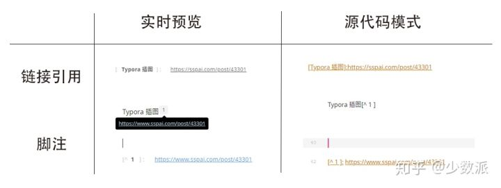
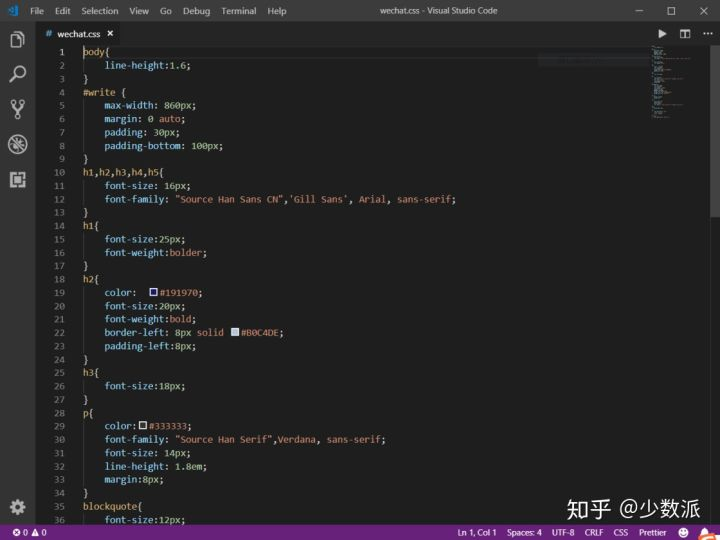

> 转载自：https://zhuanlan.zhihu.com/p/67153848

Typora 一直是我认为桌面端笔记应用应有的终极形态。用我之前 [一篇文章](https://link.zhihu.com/?target=https%3A//sspai.com/post/54122) 中的话来说就是，「它的**功能之强大、设计之冷静、体验之美妙、理念之先进**，我认为值得所有笔记应用厂商学习。」

但一件很尴尬的事情是，由于它极简的设计理念，有许多使用者并没能完全地了解到 Typora 的全部强大功能。我想在这篇文章中由浅入深地介绍 Typora 的功能亮点。无论你从未用过 Typora，还是已经体验了很久，我相信你都能在这篇文章中发现 Typora 新的惊喜。

## **Typora 是什么？**

Typora 是一款**支持实时预览的 Markdown 文本编辑器**。它有 OS X、Windows、Linux 三个平台的版本，并且由于仍在测试中，是**完全免费**的。

在这篇文章中，我希望以「Typora 是什么」这个问题为线索，向大家全面介绍这款令人爱不释手的笔记应用。

## **一个 Markdown 文本编辑器**

Typora 首先是一个 Markdown 文本编辑器，它支持且仅支持 Markdown 语法的文本编辑。在 [Typora 官网](https://link.zhihu.com/?target=https%3A//typora.io/) 上他们将 Typora 描述为 「A truly **minimal** markdown editor. 」。


### **关于 Markdown**

Markdown 是用来编写结构化文档的一种纯文本格式，它使我们在双手不离开键盘的情况下，可以对文本进行一定程度的格式排版。你可以在 [这篇文章](https://link.zhihu.com/?target=https%3A//sspai.com/post/36610) 中快速入门 Markdown。

由于目前还没有一个权威机构对 Markdown 的语法进行规范，各应用厂商制作时遵循的 Markdown 语法也是不尽相同的。其中比较受到认可的是 [GFM 标准](https://link.zhihu.com/?target=https%3A//github.github.com/gfm/)，它是由著名代码托管网站 [GitHub](https://link.zhihu.com/?target=https%3A//github.com/) 所制定的。Typora 主要使用的也是 GFM 标准。同时，你还可以在 `文件 - 偏好设置 - Markdown 语法偏好 - 严格模式` 中将标准设置为「更严格地遵循 GFM 标准」。具体内容你可以在官方的 [这篇文档](https://link.zhihu.com/?target=http%3A//support.typora.io/Strict-Mode/) 中查看。


### **写得舒服**

一个文本编辑器，**写得舒服**是关键。我曾说过，「更有趣的是，一个笔记应用不会因为它支持 Markdown 语法而高级或易用很多。」，细枝末节处的人性化考虑才是最重要的。而 Typora 的编辑体验显然是经过深思熟虑设计的产物。

我认为：一个优秀的笔记应用应该给用户**选择 Markdown 语法风格的权利**。而 Typora 在这一点上是我目前见过所有 Markdown 笔记应用中做得最好的。


通过打开 `文件 - 偏好设置` 你会发现 Typora 为编辑体验的考虑细致到了令人叹为观止的程度。Typora 中提供了大量有关 Markdown 偏好的设置，据此，你可以构建一个几乎完全适合自己的 Markdown 编辑器。下面我将依次介绍一些与文本编辑体验有关的功能亮点。

### **智能标点**

我认为「智能标点」是比较有趣的一点。它可以自动帮你将不是很美观的直引号 `"` `'` 转化为更美观的弯引号 `“` `‘` `’` `”`。具体内容你可以在官方的 [这篇文档](https://link.zhihu.com/?target=http%3A//support.typora.io/SmartyPants/) 中查看。关于直弯引号在 macOS 上如何输入你也可以看 [这篇文章](https://link.zhihu.com/?target=https%3A//sspai.com/post/38342)。

### **图片插入**

Typora 的图片插入功能是广受好评的。要知道，Markdown 原生不太注重图片插入的功能，但你可以在 Typora 中：

- 直接使用 `右键 - 复制 Ctrl + V` 将网络图片、剪贴板图片复制到文档中
- 拖动本地图片到文档中

Typora 会自动帮你插入符合 Markdown 语法的图片语句，并给它加上标题。


你也完全可以使用图床来保证文档在分享后图片仍能正常显示。

更强大的是，Typora 支持在拖动或 `Ctrl + V` 网络图片后自动将其保存到本地。你可以在 `文件 - 偏好设置 - 编辑器 - 图片插入` 中选择复制到哪个路径，什么情况下需要复制。



这一功能保证了即使网络图片源失效了，你还有本地的备份可用。同时也能使你的文档文件夹更合理、完整。

### **打字机模式和专注模式**

**「打字机模式」**使得你所编辑的那一行永远处于屏幕正中。

**「专注模式」**使你正在编辑的那一行保留颜色，而其他行的字体呈灰色。

你可以在 `视图 - 专注模式 / 打字机模式` 中勾选使用这两个模式。


### **实时预览**

我想很果断地下这个结论：到现在还不支持编辑界面实时预览的 Markdown 编辑器基本可以退出市场了。Typora 在这一方面显然已经领先了一大步——他们连 Markdown 语法的标记都在实时预览中消去了。当你离开正在编辑的有格式的文本段后，Typora 会自动隐藏 Markdown 标记，只留下**「所见即所得」**的美妙。*他们把这称为 Hybrid View。*



为了防止一些程序 bug 的发生（虽然在我使用下来感到是很少的）导致格式问题无法修改，Typora 保留了一个**「源代码模式」**。你可以通过 `视图 - 源代码模式` 或左下角的 `</>` 按钮进入。



### **大纲 / 文件侧边栏**


Typora 会根据你 Markdown 标记的 H1、H2、H3…… 各级标题为你呈现一个大纲。

你也可以选择查看文件夹中的文件，但由于目前 Typora 只支持查看 md 文件，因此我认为文件侧边栏这个功能还是很鸡肋的。

### **空格与换行**

Typora 在空格与换行部分主要是使用 [CommonMark](https://link.zhihu.com/?target=http%3A//www.commonmark.cn/w/) 作为标注规范。与前文提到的 GFM 一样，CommonMark 也是比较流行的 Markdown 语言规范（解析器）之一。

- **空格：**在输入连续的空格后，Typora 会在编辑器视图里为你保留这些空格，但当你打印或导出时，这些空格会被省略成一个。 
  你可以在源代码模式下，为每个空格前加一个 `\` 转义符，或者直接使用 HTML 风格的 `&nbps;` 来保持连续的空格。
- **软换行：**需要说明的是，在 Markdown 语法中，换行（line break）与换段是不同的。且换行分为软换行和硬换行。在 Typora 中，你可以通过 `Shift + Enter` 完成一次软换行。软换行只在编辑界面可见，当文档被导出时换行会被省略。
- **硬换行：**你可以通过 `空格 + 空格 + Shift + Enter` 完成一次硬换行，而这也是许多 Markdown 编辑器所原生支持的。硬换行在文档被导出时将被保留，且没有换段的段后距。
- **换段：**你可以通过 `Enter` 完成一次换段。Typora 会自动帮你完成两次 `Shift + Enter` 的软换行，从而完成一次换段。这也意味着在 Markdown 语法下，换段是通过在段与段之间加入空行来实现的。
- **Windows 风格（CR+LF）与 Unix 风格（CR）的换行符：**CR 表示回车 `\r` ，即回到一行的开头，而 LF 表示换行 `\n` ，即另起一行。 
  所以 Windows 风格的换行符本质是「回车 + 换行」，而 Unix 风格的换行符是「换行」。这也是为什么 Unix / Mac 系统下的文件，如果在 Windows 系统直接打开会全部在同一行内。 你可以在 `文件 - 偏好设置 - 编辑器 - 默认换行符` 中对此进行切换。

下附以上各空格、换行、换段的测试结果图。具体内容你可以在官网的 [这篇文档](https://link.zhihu.com/?target=http%3A//support.typora.io/Line-Break/) 中查阅。



### **emoji 表情**

如今 emoji 表情越来越多地出现在一些网站文章中，但在桌面端（特别是 Windows 系统）文本编辑器上插入 emoji 是一件十分麻烦的事情。在使用 Typora 之前，我打出 emoji 表情的办法基本有两个：

1. **输入法联想：**优点是比较方便，但会插入一张图片而不是一个字符，在许多情景下都不是很合适。
2. **复制 emoji 符号：**优点是能保证符号的形式，但显然每次用都需要去复制，比较麻烦。





在 Typora 中，你可以用 `:emoji:` 的形式来打出 emoji，软件会自动给出图形的提示，还是比较好用的。



## **一个学术文档编辑器**

除了基本的文本编辑体验极佳之外，Typora 还是一个非常优秀的学术文档编辑器。当然作为一个轻量级的、基于 Markdown 的编辑器，它不能与那些 LaTeX 编辑器相提并论，但它仍支持了许多可用于学术写作的功能。

### **LaTeX**

> LaTeX 是一种基于 TeX 的排版系统，由于它易于快速生成复杂表格和数学公式，非常适用于生成高印刷质量的科技和数学类文档。如果你常阅读数学、计算机等领域的学术论文，你一定对 LaTeX 不陌生。

Typora 原生支持 LaTeX 语法，你有两种方式输入 LaTeX 风格的数学公式：

1. **行内公式（inline）：**用 `$...$` 括起公式，公式会出现在行内。
2. **块间公式（display）：**用 `$$...$$` 括起公式（注意 `$$` 后需要换行），公式会默认显示在行中间。

具体的 LaTeX 语法在此不赘述了，你可以在 [这篇文章](https://link.zhihu.com/?target=https%3A//blog.csdn.net/happyday_d/article/details/83715440) 中查看。

### **代码高亮**

Typora 中代码的插入也可以分为行内和块间两种：

1. 行内代码：用 ``...`` 或 ```...``` 括起代码，代码会以主题中设置的样式出现在行内，但不会实现代码高亮。
2. 代码块：输入 ````` 后并输入语言名，换行，开始写代码，Typora 就会自动帮你实现代码高亮。Typora 原生支持许多编程语言代码块的语法高亮，基本日常常用的编程语言它都能很好地支持。 
   除此以外，你也可以直接换行开始写，而后再选择语言。


### **表格**

在 Markdown 中插入表格一直是一件比较头疼的事情。在一般的 Markdown 编辑器中，你可以通过以下的格式插入表格：

```text
| 左对齐 | 右对齐 | 居中对齐 |
| :-----| ----: | :----: |
| 单元格 | 单元格 | 单元格 |
| 单元格 | 单元格 | 单元格 |
```

乍一看还挺直观好用的是吧？但想想，一旦表格内容层次不齐，又或是表格长得难以下手，直接用键盘输入表格就显得十分麻烦和痛苦了。

好在 Typora 为我们提供了图形界面的插入表格的功能，你只需要在行内 `鼠标右键 - 插入 - 表格`，并输入行数和列数，Typora 就会自动生成一张样式不错的空表格。


### **链接引用与脚注**

**链接引用**类似于我们常在论文末尾看到的「参考文献」的写法，你可以通过 `[]:` 的语法来为你的文档加上链接引用。

**脚注**在少数派的文章中也很常见，即某段话结尾右上角标有数字标记，页面底部进行注释的写法。你可以在需要插入脚注标号的位置写 `[^ number ]` ，再在下方通过 `[^ number ]:` 在文档中插入脚注。注意不要遗漏了脚注编号 `number` 前后的空格。



### **文件系统**

除了前文提到的文件侧边栏，Typora 还提供了一些耦合度不高的文件系统。

- **快速打开：**你可以通过 `文件 - 快速打开...` 或 `Ctrl + P` 快捷键快速打开最近的文档。
- **保存：**Typora 支持自动保存，一般很少有写好的文档丢失的情况。同时它也提供了诸如「保存」、「另存为」、「保存全部打开的文件...」之类的功能。
- **导入：**Typora 支持非常多的文件格式：.docx, .latex, .tex, .ltx, .rst, .rest, .org, .wiki, .dokuwiki, .textile, .opml, .epub。
- **导出：**Typora 原生支持导出 PDF，HTML等格式。你可以根据软件内提示安装 **Pandoc 插件**来导出更多例如 docx，LaTeX 等格式。


## **一个伪装成文本编辑器的浏览器**

当我的一个朋友问我「Typora 有什么好写的？」时，我回答「Typora 是一个伪装成文本编辑器的浏览器」。是的，事实上如果你有一定的计算机基础，你可以找到许多有关于「Typora 其实是一个浏览器」的蛛丝马迹。


在图片插入的选项中，Typora 用了「复制图片到 ./${filename}.assets 文件夹」的说法，而这其实是网页后端常用的 PHP 语言的风格。

再比如，Typora 将更遵循 GFM 标准的 Markdown 语法模式称为「严格模式 Strict Mode」，这一说法常见于 HTML 和 JavaScript 编程中。类似「源代码模式」的说法也是同理。

当然，最明显的一点是当你按下 `Shift + F12` 快捷键时，页面会弹出一个基于 Chrome 的开发者工具栏，也就是我们在浏览器中常说的「审查元素」。


### **伪装从何而来？**

当我们把视角放在「Typora 是一个支持 Markdown 语言的文本编辑器」的出发点来考虑这个问题，一切就都显得很明白了。

John Gruber 在 2004 年用 Perl 创造了 Markdown 语言，这个语言的目的是希望大家使用「易于阅读、易于撰写的纯文字格式，并选择性的转换成有效的 XHTML（或是 HTML）」。也就是说，**在 Markdown 诞生之初，它就是为了被浏览器阅读而设计的。**

我们在用 Markdown 语言撰写文稿的时候，其实本质上是在借助某种编程语言的转化（解析器）来编写一个 HTML 网页。Markdown 从它诞生之初就与 Web 技术有着及其紧密的联系。

如果我说，我们每一篇文稿都是一个网页，那就很好理解了。Typora 利用解析器先将我们写的 Markdown 文档解析成为 HTML 文档，再为它嵌入一个 CSS 样式，最后再加上可能需要的脚本等。

### **HTML**

HTML 是一种标记语言，主要负责构成网页的骨架，它包含所有不加装饰的网页元素。在 Typora 的使用场景下则是所有的**文本、段落、标题等**的记号。

你可以把一张网页想象成一幅数字油画，HTML 就是那个黑白线条的底，上面写满了数字标记，示意你哪一块区域要涂什么颜色。而 CSS 则负责在对应的区域涂上颜色，甚至加上一些装饰等。


### **HTML 标签**

Typora 支持许多常用的 HTML 标签，如果你了解 HTML 语法的话，你可以写出十分美观丰富的文档页面。


事实上你可以在 Typora 中完成许多基本的 HTML 风格的文本输入，例如 HTML 字符、HTML 块、HTML 风格的注释，甚至是视频和音频。具体支持的功能和限制请在 [官方文档](https://link.zhihu.com/?target=http%3A//support.typora.io/HTML/) 中查阅。

有了这一功能，我们就可以在 Typora 中创造出远超普通 Markdown 文档的页面效果。

### **导出为 HTML**

Typora 原生支持将文档导出为 HTML 格式的文件，并选择是否要嵌入 style（也就是后文我将提到的 CSS 的部分）。

除此之外，由于其本身「浏览器」的属性，你可以直接在实时预览界面用 `Ctrl +C` 复制到 HTML 代码。一个实用的用处是将这些 HTML 代码直接 `Ctrl + V` 黏贴到微信公众号后台，基本可以保证两边显示效果相同。这一点不仅使公众号推送可以有更自由、美观的样式，也让编辑、排版更轻松了。（由于微信自带浏览器的一些特性，可能有少部分 CSS style 不能生效，建议多多校对。）


具体如何用 Typora 完成公众号写作，你可以在 [这篇文章](https://link.zhihu.com/?target=https%3A//sspai.com/post/40524) 中进一步了解。

### **CSS**

为了让文档更美观，我们可以为其加上 CSS style。我认为 Typora 对 CSS 的支持让它成为一众桌面笔记应用中最与众不同的一个。在 Typora 中 CSS 被称为「主题」，但其本质仍是 CSS 文件。你可以在 `文件 - 偏好设置 - 主题 - 打开主题文件夹` 看到这些 CSS 文件。


选择不同的主题可以使文档拥有不同的外观，但不会影响内容。Typora 自带了若干主题，你也可以在 [官网](https://link.zhihu.com/?target=http%3A//theme.typora.io/) 下载更多的主题。


除此以外，如果你有一定的 Web 编程基础，你当然也可以自己修改、新建适合你使用需求的 CSS 文件。我自己就写了一份名为 WeChat 的 CSS 文件，来符合我公众号特定的排版需求，例如正文是 15px，页边距是 8，小标题是 18px 等等。



使用 Typora 的「主题」功能写公众号的一个好处是，只需要每次都套用同样的主题，我们就可以在保证每次排版规范都相同的同时，节省许多重复的工作。

### **YAML front-matter**

Typora 支持在文档头部加上基于 YAML 的 front-matter 信息，这一特性适用于把 Markdown 文档分类归档上传到用 Hexo 框架搭建的博客中。我对于这一点不太了解，这里就不误导大家了。有所了解的朋友可以在评论区谈谈！

## **写在最后**

如果你看过 Typora 的 [更新日志](https://link.zhihu.com/?target=https%3A//typora.io/dev_release.html) 你会发现它早在 2015 年 12 月 19 日就发布了 0.7.0 (alpha) 版本，但到目前为止它仍处于 beta 阶段。*截止到笔者写作这篇文章的初稿时，Typora 的版本号为 0.9.9.24.6 (beta)。*

我想，能够潜心三年多打磨、测试一个产品，开发者们一定是倾注了极大的心血到这款笔记应用中。而在使用中，我也能体会到开发者的良苦用心。他们不想做知识的储备中心，不想做快速的草稿、笔记应用，也不想做任何和生产力无关的功能和特性。对于 Typora 的设计和构想，只有唯一的宗旨——**「生产效率」**。

因为移动端生产效率低，所以只有桌面端应用。因为左顾右盼的两栏式预览影响思路，所以他们甚至去掉了 Markdown 语法标记，只留下最终呈现的样式。因为 Markdown 是为了 HTML 呈现而设计的，所以他们提供了从入门到高级的一系列 Web 辅助功能…… 这一切都只是为了纯粹的**生产效率**。如果我们回头想想，Markdown 语言本身，当初不也是为了高效地生成简单网页而诞生的吗？

最后，让我们一起期待这款**顶级桌面文本生产力工具**的正式版的到来吧！😆

## **参考**


1. [Front-matter - Hexo](https://link.zhihu.com/?target=https%3A//hexo.io/zh-cn/docs/front-matter)
2. [让 Markdown 写作更简单，免费极简编辑器：Typora](https://link.zhihu.com/?target=https%3A//sspai.com/post/30292)
3. [使用 Typora 一次性搞定公众号写作与排版](https://link.zhihu.com/?target=https%3A//sspai.com/post/40524)
4. [简中求效：Markdown 遇上 LaTeX](https://link.zhihu.com/?target=https%3A//sspai.com/post/36420)
5. [关于Typora + pandoc导出文件功能的介绍](https://link.zhihu.com/?target=https%3A//blog.csdn.net/jiajikang_jjk/article/details/80380133)
6. [我的 LaTeX 入门](https://link.zhihu.com/?target=https%3A//blog.csdn.net/shujuelin/article/details/79340373)
7. [选择正确的 Markdown Parser](https://link.zhihu.com/?target=https%3A//www.cnblogs.com/lfk-dsk/p/5205969.html)
8. [Typora —— 能用 ⌘C⌘V 插图的 Markdown 编辑器](https://link.zhihu.com/?target=https%3A//sspai.com/post/43301)
9. [HTML Support in Typora - Typora](https://link.zhihu.com/?target=http%3A//support.typora.io/HTML/)
10. [Markdown - Wikipedia](https://link.zhihu.com/?target=https%3A//zh.wikipedia.org/wiki/Markdown)
11. [Windows、Unix、Mac不同操作系统的换行问题-剖析回车符\r和换行符\n](https://link.zhihu.com/?target=https%3A//blog.csdn.net/tskyfree/article/details/8121951)
12. [简中求效：Markdown 遇上 LaTeX](https://link.zhihu.com/?target=https%3A//sspai.com/post/36420)
13. [通用标注 (CommonMark)](https://link.zhihu.com/?target=http%3A//www.commonmark.cn/w/)
14. [Whitespace and Line Breaks - Typora](https://link.zhihu.com/?target=http%3A//support.typora.io/Line-Break/)